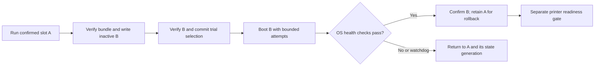

# Proposed host OS and A/B deployment

Status: proposal awaiting owner choices, not an accepted architecture or flashable
image. Assessment date: 2026-09-09. Printer offline; no printer connection or
hardware changes were attempted. Applies first to
[test-sv08-01](../hardware/test-sv08-01.md), not every H616 board.

## Recommended direction

Build a small Debian 13 arm64 appliance image using deb/apt. Deploy signed,
complete releases with RAUC into two OS slots, each with its own kernel, DTB,
initramfs, modules and application stack. Mount the active OS read-only; keep
explicit persistent data separately. Build on the workstation, not the printer.
Prefer upstream U-Boot/SPL and TF-A, with board support verified independently.

For the stated latest kernel.org LTS requirement, evaluate a project-packaged
6.18.y kernel first. Prefer a maintained distro package if it meets the selected
branch and hardware requirements; do not freeze an obsolete backports binary
and call that maintained. Final selection follows the questions below and a
board-support audit. No new source revision is selected by this proposal.

This is a custom **image of Debian**, with a small integration/package layer.
A wholly separate distribution is unnecessary unless measurements or required
hardware support demonstrate a gap. The existing
[vendor-assisted bring-up image](../hardware/test-sv08-01-image.md) remains an
experimental baseline; this proposal does not modify it.

## Debian, Ubuntu and a separate custom distribution

| Option | Fit for this project | Cost / limitation | Assessment |
| --- | --- | --- | --- |
| Debian 13 minimal | Native deb/apt, existing project experience, small package selection, upstream-style services | Board boot support still ours; stable kernel is older than newest upstream LTS | Preferred userland |
| Ubuntu Server 26.04 LTS minimal | Native deb/apt, longer standard release maintenance, Canonical ecosystem | Does not establish SV08 board support; kernel policy differs from kernel.org LTS; package coverage varies | Valid alternative if Canonical support/ecosystem matters |
| Ubuntu Core | Image-oriented system built from base/kernel/gadget/application snaps | OS management is snap-based, not conventional host apt; board gadget/kernel integration needed | Poor fit for the stated package-manager preference |
| Yocto/OpenEmbedded distribution with deb output | Strong control over recipes, footprint and image composition; can provide APT feeds | We maintain recipes, feed, upgrades and security integration; deb format does not imply Debian repository/ABI compatibility | Reserve for an identified requirement |
| Buildroot / from-scratch distribution | Can make a small fixed appliance | Buildroot does not target a conventional binary-package-managed distribution; adding apt is substantial extra integration | Reject for this requirement |

Debian identifies 13 as stable, with full support to August 2028 and LTS to June
2030; check architecture/package coverage rather than assuming every component
has identical coverage. Its release notes list Linux 6.12. Ubuntu lists 26.04
LTS standard maintenance to May 2031, with extended coverage options; this is
not a support commitment for our board integration or custom kernel.
Sources: [Debian lifecycle](https://www.debian.org/releases/),
[Debian 13 changes](https://www.debian.org/releases/trixie/release-notes/whats-new.en.html),
[Ubuntu lifecycle and package coverage](https://ubuntu.com/about/release-cycle).

The custom-distribution comparison uses
[Yocto package management](https://docs.yoctoproject.org/dev/dev-manual/packages.html),
[Buildroot's design/manual](https://buildroot.org/downloads/manual/manual.html), and
[Ubuntu Core snap composition](https://documentation.ubuntu.com/core/explanation/core-elements/snaps-in-ubuntu-core/).
Performance rankings are not measured: both Debian and Ubuntu can be stripped
of unnecessary services. A smaller package list alone does not prove faster boot.

## Kernel policy and upstream hardware support

Kernel.org lists **6.18 as the newest longterm branch**, with projected EOL in
December 2028. Select the latest reviewed patch release in that branch when
building, record its exact source hash, and rebuild for security fixes. Recheck
the longterm list before each branch decision; dates can change.
[Kernel.org release policy](https://www.kernel.org/category/releases.html).

| Kernel source | Benefit | Obligation / trade-off |
| --- | --- | --- |
| Debian stable 6.12 | Distro packaging/security integration, low local maintenance | Does not meet a strict newest-kernel.org-LTS requirement; board functionality still needs tests |
| Debian backports | Newer distro-built kernel | The current arm64 meta-package points to 7.1.8, not 6.18; it tracks newer kernels rather than promising indefinite 6.18 maintenance |
| Ubuntu LTS distro kernel | Canonical maintains its chosen kernel series | 26.04's arm64 generic package currently reports 7.0; distro LTS and kernel.org longterm are different policies |
| kernel.org 6.18.y packaged by this project | Meets the requested branch; explicit config and patch provenance | We own config, .deb packaging, patch intake, regression testing and update delivery |

Current package checks: [Debian backports arm64](https://packages.debian.org/trixie-backports/linux-image-arm64),
[Ubuntu 26.04 generic](https://packages.ubuntu.com/resolute/linux-generic).
These are dated observations, not floating build inputs. Ubuntu's experimental
mainline kernel builds are not the proposed production update source.

“In-tree” includes Allwinner drivers named `sunxi`, `sun50i`, etc. The requirement
is to retire the vendor BSP/out-of-tree drivers, not remove upstream Allwinner
code. Loadable upstream modules are acceptable; only boot-critical drivers need
be built in or supplied in the initramfs. Never mix the old 5.16 modules/DTB with
a new kernel. Firmware blobs loaded by an upstream driver are a separate choice
from out-of-tree driver code.

Local evidence: H616 device-tree compatible, approximately 1 GiB RAM reported by
Linux, working vendor-assisted eMMC/Ethernet/USB baseline, and an HDMI/USB touch
capture. PCB revision and complete host schematic remain unknown. The preserved
boot archive contains `8189fs.ko`; this is evidence of a shipped driver, not proof
of the installed radio's identity or active binding. See
[discovery](../hardware/test-sv08-01-discovery.md) and
[image baseline](../hardware/test-sv08-01-image.md).

| Feature | Upstream evidence / acceptance gate |
| --- | --- |
| CPU, clocks, eMMC, USB, Ethernet, thermal/watchdog | H616 SoC nodes exist in upstream 6.18; verify enabled drivers, board regulators, pinmux, PHY wiring and DT bindings individually |
| DRAM and initial boot | Separate SPL/U-Boot/TF-A task; no other board's DRAM config may be assumed correct |
| Onboard Wi-Fi | Identify SDIO device and match exact upstream driver; the vendor `8189fs` module cannot be retained under the strict in-tree requirement |
| HDMI touchscreen | The inspected 6.18 H616 dtsi has no HDMI/display-pipeline nodes; GPU support is not proof of scanout support. Audit driver/binding support and bootloader framebuffer handoff before promising a display |
| USB touch and camera | Match actual IDs/interfaces; test touch mapping and UVC operation, then streaming load. No assumed hardware video encoder support |
| Stock control display | MCU-driven display path is separate from Linux HDMI; retain as a separately validated printer feature |

Source inspection: [Linux v6.18 H616 dtsi](https://raw.githubusercontent.com/torvalds/linux/v6.18/arch/arm64/boot/dts/allwinner/sun50i-h616.dtsi).
This is a gap assessment, not a claim that every missing feature is impossible.
If a required feature lacks an upstream driver, expose the conflict: wait for
upstream support, explicitly choose an alternative supported peripheral/host,
or reconsider the kernel policy. Do not silently introduce a vendor module.
A board-specific DTS using upstream bindings may still be necessary; keep it
reviewed and versioned with an upstream submission/retirement plan.

## A/B implementation

Prefer RAUC for signed bundles, slot grouping and U-Boot integration.
[RAUC integration](https://raw.githubusercontent.com/rauc/rauc/master/docs/integration.rst)
and [bundle design](https://raw.githubusercontent.com/rauc/rauc/master/docs/basic.rst)
provide the mechanisms; the policy below is our proposed integration.

SWUpdate is a viable alternative with flexible handlers, including more complex
multi-device updates. We do not yet need that flexibility.
[SWUpdate documentation](https://sbabic.github.io/swupdate/swupdate.html).
Systemd-sysupdate can deploy versioned files/partitions, but still needs boot
selection and success handling on this U-Boot board; using it would not remove
that work. Prefer one deployment authority.
[systemd-sysupdate source documentation](https://raw.githubusercontent.com/systemd/systemd/main/man/systemd-sysupdate.xml).

Proposed space budget for the measured 31,272,730,624-byte spare (about 29.13 GiB):

| Region | Proposed capacity | Update behavior |
| --- | --- | --- |
| Boot firmware / redundant environment reservation | 16 MiB budget; offsets TBD | Excluded from routine OS updates |
| boot A + root A | 256 MiB + 6 GiB | One complete release |
| boot B + root B | 256 MiB + 6 GiB | One complete release |
| Recovery | 512 MiB | Small network/USB recovery image, separately maintained |
| Persistent data | Remainder, roughly 16 GiB | Never formatted by routine updates |

Sizes are provisional, including room for applications, touchscreen dependencies
and growth. Cap image occupancy at 75% of its slot before release. Reserve data
space for an incoming bundle, state backups and logs; reject updates if space is
insufficient. Store bundles on disk, not in a 1 GiB RAM tmpfs. Large recordings
need retention limits or external storage.

Use GPT only after validating the H616 boot location and new SPL. Upstream
U-Boot documents the conflict between its traditional 8 KiB boot location and
GPT, and an alternative 128 KiB location on newer Allwinner SoCs. **Do not copy
the old captured prefix over a new GPT image.** The precise eMMC boot path,
environment offsets and redundant writes must be tested on this board.
[Allwinner U-Boot boot layout](https://docs.u-boot.org/en/latest/board/allwinner/sunxi.html).

Prefer the upstream RAUC boot method if the selected U-Boot build supports it;
it supports paired boot/root partitions and per-slot attempt counters.
[U-Boot v2026.01 RAUC boot method](https://docs.u-boot.org/en/v2026.01/develop/bootstd/rauc.html).
Start with three trial attempts, a redundant persistent environment, and a tested
watchdog path. Avoid endless resetting of exhausted counters: both failed slots
should enter recovery. A boot attempt counter alone cannot recover a hung kernel
without a watchdog/reset. A broken SPL/U-Boot or failed eMMC remains outside
ordinary A/B protection; retain the USB-reader recovery route.

Update transaction proposal:

1. Check release signature, hardware profile/layout, available space, version and
   MCU compatibility. Downloads may occur during printing with low priority;
   initially restrict slot writes, migrations, activation and reboot to idle.
2. Mark B unbootable before modifying it. Write B's boot/root pair without
   touching A, the partition table or persistent user artifacts. Verify output
   and flush storage before making B the preferred trial slot.
3. Prepare a consistent, versioned copy of mutable application state while the
   relevant services are stopped. Record the intended state generation for B.
4. Boot B. Confirm local storage, persistent mounts, required network interface
   initialization, SSH, update/recovery services and local application health.
   Do not require Internet, DHCP success or an attached MCU to avoid pointless
   rollback loops when external equipment is unavailable. Test remote reachability
   separately during commissioning; a valid static misconfiguration needs manual
   rollback through an available management path.
5. Mark good only after a bounded stable interval. Keep printing disabled until
   config, MCU-version and sensor checks pass. An MCU/probe fault should leave
   remote diagnostics available, not force repeated OS reboots.
6. On trial failure, boot A with A's compatible state. Retain B's logs and any
   newly created artifacts. Do not erase user files as part of rollback.

## Persistence and package management

Use read-only ext4 roots initially: simple tooling and easy inspection. Evaluate
dm-verity after the basic boot path works; read-only mounting is not a verified
boot chain. Signed update bundles authenticate installation but do not alone
protect every boot stage. EROFS/SquashFS are later measured options, not assumed
performance wins. Do not use a permanent overlay of the entire old root or /etc;
it can silently mask fixes from the new release.

APT remains the build/package manager. The release's dpkg database, installed
files, Python environments and system defaults all belong to that same OS slot.
Do not share `/var/lib/dpkg`, apt state, all of `/var`, or all of `/etc` between
slots. Do not run unattended apt upgrades against the active image. Build fresh
images from pinned repository snapshots and an explicit extra-package manifest;
normal security updates arrive as newly tested images. Snapshots pin inputs,
not a permanent exemption from security maintenance.

If direct on-printer `apt install` is required, offer a distinct writable
maintenance/developer mode with a recorded package manifest. Local changes are
not automatically preserved by replacing the OS image. Incorporate them into a
new release before claiming repeatability; the alternative is a traditional
writable design with more drift to reconcile. Do not chroot into the fallback
slot with shared host state and let package scripts alter the running system.

| Data class | Persistence policy |
| --- | --- |
| SSH host identity, authorized users, network settings, machine identity | Explicit persistent records, restrictive ownership, generated/bind-mounted paths; fixed service UID/GID assignments |
| Printer configs, macros, calibration, UI preferences | Persistent, versioned user content; migration works on a copy and preserves the original |
| Moonraker database and other schema-dependent state | Consistent per-release generation; copy/migrate before trial; previous generation retained for rollback |
| G-code, timelapse, uploaded files | Shared persistent artifacts; never rolled back with the OS; quotas/retention explicit |
| Logs, update status and recovery diagnostics | Bounded persistent storage, survive failed trials |
| PID files, sockets, temporary files | tmpfs; recreated at boot |
| Package database, libraries, application binaries | Slot-local, matching the release |

Shared storage alone does not guarantee rollback compatibility. During trial,
keep jobs disabled and preserve pre-migration state. For a later rollback after
normal use, refuse to feed a newer database to an older application unless
compatibility is tested. Reuse the old compatible state generation while
retaining newer data for export/merge; explain any history/settings differences.
Config edits remain archived even if an older parser cannot activate them.
A/B is not a backup of the shared data partition; export private backups to
separate storage and test restoration.

## Applications: packages versus snaps

Preferred first version: package the pinned Klipper host environment, Moonraker,
Mainsail static assets and optional KlipperScreen into the image; run ordinary
systemd services. This avoids a second independently advancing release mechanism.
Package pinned Python wheels/venvs rather than live pip or git updates. Add project
.debs only where upstream/distro packages do not represent the selected stack.
Moonraker must not independently replace these image-managed applications.

Snaps can provide read-only application payloads and revision management, but
their writable state is not immutable. Refresh/revert and shared data need their
own migration policy. Snapd supports holding refreshes; this is necessary but
not sufficient for coordinated printer updates.
[Snap update and revert behavior](https://snapcraft.io/docs/how-to-guides/manage-snaps/manage-updates/).
If selected, pin/test ARM64 revisions, serial/USB interfaces, display access,
AppArmor confinement and refresh hooks. Never refresh Klipper during a print.
A shared `/var/lib/snapd` that advances under B must not be assumed compatible
when booting A; provide slot/version-compatible snap state or coordinated
snapshots. Benchmark snap startup/RAM overhead rather than claiming it is always
slow. Ubuntu Core does not remove the conflict with conventional host apt.

MCU firmware is **not an A/B OS partition**. Initially keep the existing matching
host/MCU Klipper revision across OS-only releases. For a Klipper revision change,
bundle both boards' matching firmware and an explicit maintenance transaction.
Before starting Klipper, compare expected/current versions; keep outputs disabled
on mismatch. Preserve previous binaries and a separately tested Katapult rollback
procedure. Never assume rebooting A restores either MCU. Incomplete two-board
updates must remain recoverable over USB and must not trigger blind reflashing
on each boot. See [USB update decision](../decisions/0003-usb-mcu-updates.md).

## Boot and runtime performance

Target budgets for discussion, **not measured promises**: cold boot to SSH/local
API within 20 seconds and usable touchscreen within 30 seconds, excluding a
trial's deliberate health interval. Measure cold/warm boots at least 20 times,
report median/worst values, and distinguish bootloader, kernel, userspace,
network availability and printer-ready time.

Start with systemd, udev, networkd (or NetworkManager if Wi-Fi provisioning
requires it), SSH, time synchronization, Klipper, Moonraker, a small web server
and optional UI/camera services. No general desktop/login manager, first-boot
cloud discovery or unrelated daemons. Avoid boot-wide waits for Internet; retain
time synchronization and handle bad initial clocks for signed downloads.
Use a small initramfs until mount/recovery requirements are proven; remove it
only if measurement justifies the resulting complexity.

Retain thermal management, watchdogs, filesystem integrity checks when needed,
heater protections and diagnostics. Test cpufreq/governor behavior; do not
assume maximum fixed frequency is better. Begin with standard kernel scheduling;
PREEMPT_RT is an experiment only if measured Klipper latency requires it. No
kernel/firmware compilation on the printer. Bound journal size and camera usage;
evaluate modest zram under load, avoid sustained eMMC swap. Validate MCU timing
while UI/camera/network/download workloads run; stop update staging if it causes
latency or memory pressure. App and driver requirements determine the final
package/config set, not an arbitrary smallest-image target.

## Work plan and acceptance gates

1. **Offline now:** settle owner questions; audit captured DTB/boot environment
   against exact upstream bindings, inventory driver gaps and source licenses.
   Identify required DRAM/PHY/radio evidence without substituting another board.
2. **Offline:** record accepted ADR, pin Linux/U-Boot/TF-A/RAUC and toolchains;
   package kernel and userspace. Extend image tooling through separate stages
   for bootstrap, packages, slot assembly, signed bundle and inspection. Default
   all writing tools to dry-run; build artifacts remain ignored.
3. **Offline:** test partition bounds and GPT/boot offset interaction; inspect
   matching kernel/modules/DTB/initramfs; validate systemd units and mounts.
   Use QEMU for ARM64 userspace and U-Boot sandbox where applicable. Simulate
   failed slot writes, bad signatures, incorrect hardware IDs, full data disk,
   unsuccessful trials, state migrations and downgrade handling. Emulation does
   not validate the H616 board or its power-failure behavior.
4. **Owner when available:** preserve current spare-module data/image, provide
   host PCB/radio/DRAM evidence and access to boot diagnostics where practical.
   Repartitioning requires a new whole-device image; do not attempt a blind
   online conversion of the current single-root layout. Write only the identified
   spare, retain factory media and verify recovery access.
5. **Bench:** establish upstream cold boot, memory/storage/network/USB, watchdog,
   thermal/cpufreq and every required UI/camera feature. Record absent or failing
   features explicitly. Then measure boot/runtime budgets.
6. **Bench recovery:** A→B→A success; corrupt/truncated B and kernel failure;
   watchdog hang recovery; interrupted writes/environment updates; both slots
   failed; shared-data migration failure; no network; no MCU; reboot after MCU
   revision change. Attended power-cut tests only with printer loads safe and
   expendable backed-up data. Demonstrate USB-reader restore separately.
7. **Release gate:** all required features pass, same-pin host/MCU policy or tested
   transition, printing commissioning complete, data restore demonstrated,
   manifests/hashes/signatures and owner documentation published. No automatic
   reboot during a print; no resume of motion after an OS recovery reboot.

## Owner questions

Answer by number with yes/no. Recommendations are provisional, not assumed
answers. Question 1 resolves what “use apt” means; questions 3–6 determine
whether upstream hardware gaps can be accommodated.

| # | Question | Suggested answer / consequence |
| --- | --- | --- |
| 1 | Is using apt to build complete updates sufficient, without routine `apt install` on the running printer? | Yes: read-only A/B; no: design a writable maintenance path |
| 2 | Must the kernel use the latest kernel.org LTS branch, even if we maintain its packages ourselves? | Yes, matching your stated preference; no: prefer a suitable distro-maintained kernel |
| 3 | Must the HDMI touchscreen work in the first new OS release? | Yes if it is part of your normal workflow; this can block release on display support |
| 4 | Must the built-in Wi-Fi work in the first release? | No if Ethernet is sufficient; yes makes radio identification/support a release gate |
| 5 | If a peripheral has no upstream driver, would you accept a supported USB replacement? | Yes gives an in-tree fallback, subject to available ports and verified hardware |
| 6 | Are vendor firmware files acceptable when the Linux driver itself is upstream? | Yes permits standard firmware packages; no further limits hardware choices |
| 7 | Must camera streaming and timelapse work in the first release? | Your choice; yes adds driver, storage and concurrent-load acceptance tests |
| 8 | Is it acceptable to update the OS and printer applications together as one tested release? | Yes: image-contained apps; no: design a second coordinated application release mechanism, potentially snaps |
| 9 | Should activation/reboot always wait for your explicit action, even when the printer is idle? | Yes: automatic checking/downloads can still be separate |
| 10 | Should updates work by uploading a file over the LAN with no printer Internet connection? | Yes: signed offline bundles and local management |
| 11 | Is reserving 512 MiB for an independent recovery system worthwhile? | Yes: improves recovery when both OS slots fail; does not rescue a broken early bootloader |
| 12 | Do you want Canonical commercial support/subscription integration? | No: Debian remains preferred; yes: reassess Ubuntu Server and exact coverage |

These questions do not relax the in-tree-driver requirement or authorize losing
user artifacts. If answers conflict with verified hardware capabilities, present
the specific conflict before choosing a compromise.

All linked online sources were accessed 2026-09-09. Versioned source links are
identified above; rolling documentation is research evidence, not build pinning.
