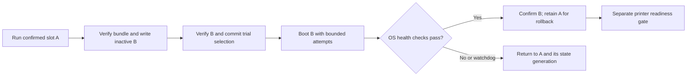

# Proposed host OS and A/B deployment

Status: revised design incorporating owner answers on 2026-09-09. Immutable
(default) and writable operating modes are accepted in
[decision 0004](../decisions/0004-os-operating-modes.md). No replacement image
has been built or validated. Assessment date: 2026-09-09. Printer offline; no printer connection or
hardware changes were attempted. Applies first to
[test-sv08-01](../hardware/test-sv08-01.md), not every H616 board.

Implementation has started with the [offline package/layout baseline](../hardware/host-ab-build.md).
It does not yet implement boot selection, operating modes or printer activation.

## Recommended direction

Build a small Debian 13 arm64 appliance image using deb/apt. Deploy signed,
complete releases with RAUC into two OS slots, each with its own kernel, DTB,
initramfs, modules and application stack. Provide immutable mode by default and
a user-selectable writable mode; keep explicit persistent data separately. Both
are supported operating choices, with mode switching and customization rules
defined in decision 0004.
Build on the workstation, not the printer.
Prefer upstream U-Boot/SPL and TF-A, with board support verified independently.

Prefer the Debian-maintained kernel, starting with the stable 6.12 series as a
candidate. The owner has relaxed the newest-kernel.org-LTS and strictly in-tree
requirements: retain existing hardware, using maintained out-of-tree modules
and vendor firmware where necessary. HDMI touchscreen and onboard Wi-Fi are
first-release requirements. Camera streaming/timelapse are desired initially;
any deferral must include a path for the existing camera, not a required purchase.
Debian remains preferred; Canonical commercial support is not wanted.

Target the factory **8 GB eMMC footprint**, including A/B and recovery. The
32 GB spare remains useful for testing but must not hide a release-size failure.
Support an opt-out automatic policy that writes the inactive slot while idle
and selects it on the next normal boot, without forcing a reboot. First-release
updates use LAN-uploaded bundles; Internet update discovery/download is a planned
extension of the same verification and deployment path.

This is a custom **image of Debian**, with a small integration/package layer.
A wholly separate distribution is unnecessary unless measurements or required
hardware support demonstrate a gap. The existing
[vendor-assisted bring-up image](../hardware/test-sv08-01-image.md) remains an
experimental baseline; this proposal does not modify it.

## Debian, Ubuntu and a separate custom distribution

| Option | Fit for this project | Cost / limitation | Assessment |
| --- | --- | --- | --- |
| Debian 13 minimal | Native deb/apt, existing project experience, small package selection, upstream-style services | Board boot support still ours; stable kernel is older than newest upstream LTS | Preferred userland |
| Ubuntu Server 26.04 LTS minimal | Native deb/apt, longer standard release maintenance, Canonical ecosystem | Does not establish SV08 board support; kernel policy differs from kernel.org LTS; package coverage varies | Valid alternative if Canonical support/ecosystem matters |
| Ubuntu Core | Image-oriented system built from base/kernel/gadget/application snaps | OS management is snap-based, not conventional host apt; board gadget/kernel integration needed | Poor fit for the stated package-manager preference |
| Yocto/OpenEmbedded distribution with deb output | Strong control over recipes, footprint and image composition; can provide APT feeds | We maintain recipes, feed, upgrades and security integration; deb format does not imply Debian repository/ABI compatibility | Reserve for an identified requirement |
| Buildroot / from-scratch distribution | Can make a small fixed appliance | Buildroot does not target a conventional binary-package-managed distribution; adding apt is substantial extra integration | Reject for this requirement |

Debian identifies 13 as stable, with full support to August 2028 and LTS to June
2030; check architecture/package coverage rather than assuming every component
has identical coverage. Its release notes list Linux 6.12. Ubuntu lists 26.04
LTS standard maintenance to May 2031, with extended coverage options; this is
not a support commitment for our board integration or custom kernel.
Sources: [Debian lifecycle](https://www.debian.org/releases/),
[Debian 13 changes](https://www.debian.org/releases/trixie/release-notes/whats-new.en.html),
[Ubuntu lifecycle and package coverage](https://ubuntu.com/about/release-cycle).

The custom-distribution comparison uses
[Yocto package management](https://docs.yoctoproject.org/dev/dev-manual/packages.html),
[Buildroot's design/manual](https://buildroot.org/downloads/manual/manual.html), and
[Ubuntu Core snap composition](https://documentation.ubuntu.com/core/explanation/core-elements/snaps-in-ubuntu-core/).
Performance rankings are not measured: both Debian and Ubuntu can be stripped
of unnecessary services. A smaller package list alone does not prove faster boot.

## Kernel policy and upstream hardware support

Kernel.org lists **6.18 as the newest longterm branch**, with projected EOL in
December 2028. This is now a comparison option, not a required branch. Prefer
distro maintenance and record exact package/source versions for each image.
Recheck support before each branch decision; dates can change.
[Kernel.org release policy](https://www.kernel.org/category/releases.html).

| Kernel source | Benefit | Obligation / trade-off |
| --- | --- | --- |
| Debian stable 6.12 | Distro packaging/security integration, low local maintenance | Now the first candidate; HDMI/Wi-Fi support must be established before selection |
| Debian backports | Newer distro-built kernel | The current arm64 meta-package points to 7.1.8, not 6.18; it tracks newer kernels rather than promising indefinite 6.18 maintenance |
| Ubuntu LTS distro kernel | Canonical maintains its chosen kernel series | 26.04's arm64 generic package currently reports 7.0; distro LTS and kernel.org longterm are different policies |
| kernel.org 6.18.y packaged by this project | Alternative if required by hardware; explicit config and patch provenance | We own config, .deb packaging, patch intake, regression testing and update delivery |

Current package checks: [Debian backports arm64](https://packages.debian.org/trixie-backports/linux-image-arm64),
[Ubuntu 26.04 generic](https://packages.ubuntu.com/resolute/linux-generic).
These are dated observations, not floating build inputs. Ubuntu's experimental
mainline kernel builds are not the proposed production update source.

“In-tree” includes Allwinner drivers named `sunxi`, `sun50i`, etc. Prefer upstream
code, but retaining the existing peripherals takes priority over a strict
in-tree-only rule. Vendor firmware files are acceptable. Never mix old 5.16
binary modules with a new kernel; build modules for its exact ABI and pair the
kernel with its reviewed DTB/initramfs.

DKMS manages module rebuild/install for kernel versions; it does not repair
incompatible driver source or supply missing kernel-core APIs, device-tree
bindings, DRAM initialization or bootloader support. A separate Wi-Fi driver may
be a suitable DKMS package after its identity and source are verified. HDMI can
require coordinated DRM/clock/PHY changes and a DTS; it cannot be assumed to be
one external module. [DKMS upstream documentation](https://github.com/dkms-project/dkms).

Evaluate support in this order: distro kernel plus board DT and existing
upstream drivers; distro kernel plus reviewed external modules; a suitable newer
distro-maintained kernel; then a documented, minimal kernel patch series if core
changes are unavoidable. A patched distro-derived build is maintained by this
project for its deltas and is not an unchanged distro-supported kernel.
Record each exception's source pin, license, kernel support range, test and
upstreaming/removal plan. Fail the release if a required driver fails to build
or load; never silently ship without Wi-Fi or the touchscreen.

Use DKMS packaging/build recipes on the build workstation or an ARM64 build
worker against the exact target headers/config. Deliver prebuilt, tested modules
inside each slot with dependency metadata and any required signatures; test
vermagic, dependency resolution and loading. Do not require kernel headers,
compilers or first-boot DKMS compilation on the 1 GiB-RAM/8 GB printer. They cost
space, startup time and introduce an untested failure after activation. Users in
writable mode may install those tools if needed and space permits. Debian candidates:
[kernel package](https://packages.debian.org/trixie/linux-image-arm64) and
[RAUC package](https://packages.debian.org/trixie/rauc); no exact build pin is
selected by consulting these rolling pages.

Local evidence: H616 device-tree compatible, approximately 1 GiB RAM reported by
Linux, working vendor-assisted eMMC/Ethernet/USB baseline, and an HDMI/USB touch
capture. PCB revision and complete host schematic remain unknown. The preserved
boot archive contains `8189fs.ko`; this is evidence of a shipped driver, not proof
of the installed radio's identity or active binding. See
[discovery](../hardware/test-sv08-01-discovery.md) and
[image baseline](../hardware/test-sv08-01-image.md).

| Feature | Upstream evidence / acceptance gate |
| --- | --- |
| CPU, clocks, eMMC, USB, Ethernet, thermal/watchdog | H616 SoC nodes exist in upstream 6.18; verify enabled drivers, board regulators, pinmux, PHY wiring and DT bindings individually |
| DRAM and initial boot | Separate SPL/U-Boot/TF-A task; no other board's DRAM config may be assumed correct |
| Onboard Wi-Fi | Required: identify SDIO device; evaluate upstream or maintained external driver source for the selected distro kernel |
| HDMI touchscreen | Required: the inspected 6.18 H616 dtsi has no HDMI/display-pipeline nodes; GPU support is not proof of scanout support. Audit driver/binding support and bootloader framebuffer handoff before promising a display |
| USB touch and camera | Touch required; camera desired. Identify actual camera interface/formats, test existing-device streaming, then timelapse and concurrent load; no assumed UVC or hardware encoder support |
| Stock control display | MCU-driven display path is separate from Linux HDMI; retain as a separately validated printer feature |

Source inspection: [Linux v6.18 H616 dtsi](https://raw.githubusercontent.com/torvalds/linux/v6.18/arch/arm64/boot/dts/allwinner/sun50i-h616.dtsi).
This is a gap assessment, not a claim that every missing feature is impossible.
If a required feature lacks an upstream driver, evaluate a pinned external driver
or kernel patch before proposing hardware replacement. Board-specific DTS and
boot-chain changes remain separate evidence-backed work. The owner authorizes
this policy, not a claim that any particular driver is already compatible.

For the camera, use captured evidence first and collect IDs, interface and
advertised formats when the printer returns. Preserve its existing-device path:
prefer pass-through of a camera-provided compressed stream where available;
otherwise test software encoding at a sustainable resolution/frame rate. Keep
streaming and timelapse independently configurable. If first-release support is
deferred, record the exact driver/streamer/format gap and its implementation
task. A different camera is not the default solution; storage limits may require
lower recording retention or LAN export without changing the camera itself.

## A/B implementation

Prefer RAUC for signed bundles, slot grouping and U-Boot integration.
[RAUC integration](https://raw.githubusercontent.com/rauc/rauc/master/docs/integration.rst)
and [bundle design](https://raw.githubusercontent.com/rauc/rauc/master/docs/basic.rst)
provide the mechanisms; the policy below is our proposed integration.

SWUpdate is a viable alternative with flexible handlers, including more complex
multi-device updates. We do not yet need that flexibility.
[SWUpdate documentation](https://sbabic.github.io/swupdate/swupdate.html).
Systemd-sysupdate can deploy versioned files/partitions, but still needs boot
selection and success handling on this U-Boot board; using it would not remove
that work. Prefer one deployment authority.
[systemd-sysupdate source documentation](https://raw.githubusercontent.com/systemd/systemd/main/man/systemd-sysupdate.xml).

Proposed space budget uses the captured factory user-area size of
**7,818,182,656 bytes = 7,456 MiB = 7.28125 GiB**, not an assumed 8 GiB.
[Factory image evidence](../hardware/test-sv08-01-backup-and-stlink.md).
This is a sizing target for that observed module, not proof that every nominal
8 GB device has the same capacity. Check actual destination size before writing.

| Region | Proposed capacity | Update behavior |
| --- | --- | --- |
| Boot firmware / redundant environment reservation | 16 MiB budget; offsets TBD | Excluded from routine OS updates |
| boot A + root A | 192 MiB + 2,048 MiB | One complete release |
| boot B + root B | 192 MiB + 2,048 MiB | One complete release |
| Recovery | 512 MiB | Self-contained kernel/initramfs and minimal rescue userspace |
| Persistent data | 2,447 MiB | User artifacts, state generations and bounded staging |
| Tail reservation | 1 MiB | Alignment and backup GPT budget |

The arithmetic totals 7,456 MiB; **package/image fit is not yet measured**.
Target no more than 1,536 MiB installed content per 2,048 MiB root and 144 MiB per
boot partition. Measure a full package closure including touchscreen, Wi-Fi,
firmware and camera software. If ext4 misses the budget, compare tighter package selection and a mode-compatible compressed-root design before revising the layout; do not
drop required features or rely on 32 GB to pass. Compression must be benchmarked
on the H616. Root compression and RAUC bundle compression are different layers.

Initial staging budget: at most 1,024 MiB for one signed bundle, 256 MiB reserved
for state copies and migration work, and at least 512 MiB free after staging.
These are proposed limits, checked against actual bundle and live state sizes;
they leave roughly 655 MiB for other content at those maxima, before filesystem
overhead. UI must show remaining capacity and reject a too-large update without
deleting user files. Keep one incoming bundle, promptly remove confirmed obsolete
staging files, and bound logs/recording retention. The 32 GB profile may expand
only the data partition; fixed OS slots remain identical.

If measured bundles do not fit alongside realistic user data, evaluate RAUC's
verified HTTP-range streaming from a LAN computer before relaxing update
availability. This needs explicit server/client integration and interrupted-link
tests; a browser upload is not automatically that protocol. First-release LAN
file upload remains required and must pass a realistic free-space acceptance
case. [RAUC streaming design](https://raw.githubusercontent.com/rauc/rauc/master/docs/advanced.rst).
Never place a full bundle in RAM or count the running/fallback root as scratch.

Recovery must carry its own tested eMMC, Ethernet and required Wi-Fi drivers and
firmware, identity/network provisioning path, SSH and a minimal restore/upload
interface; it must not depend on either damaged root's modules. Provide a local
entry method when display support permits and an automatic path after both
slots fail. Treat 512 MiB as a measured build gate. It can repair OS slots and
export readable user data; it cannot repair failed storage or an unbootable
SPL/U-Boot. Routine recovery does not format the persistent partition.

Use GPT only after validating the H616 boot location and new SPL. Upstream
U-Boot documents the conflict between its traditional 8 KiB boot location and
GPT, and an alternative 128 KiB location on newer Allwinner SoCs. **Do not copy
the old captured prefix over a new GPT image.** The precise eMMC boot path,
environment offsets and redundant writes must be tested on this board.
[Allwinner U-Boot boot layout](https://docs.u-boot.org/en/latest/board/allwinner/sunxi.html).

Prefer the upstream RAUC boot method if the selected U-Boot build supports it;
it supports paired boot/root partitions and per-slot attempt counters.
[U-Boot v2026.01 RAUC boot method](https://docs.u-boot.org/en/v2026.01/develop/bootstd/rauc.html).
Start with three trial attempts, a redundant persistent environment, and a tested
watchdog path. Avoid endless resetting of exhausted counters: both failed slots
should enter recovery. A boot attempt counter alone cannot recover a hung kernel
without a watchdog/reset. A broken SPL/U-Boot or failed eMMC remains outside
ordinary A/B protection; retain the USB-reader recovery route.

Update policy and transaction proposal:

1. Persist a user-selectable policy, independent of immutable/writable mode:
   automatic idle staging/next-boot activation, or manual opt-out. Customized
   systems need successful reconciliation before activation, as defined in
   decision 0004; an unresolved customization blocks that update. Show pending version, staging state and cancellation in the
   UI. Cancelling before trial selection keeps A preferred. If opted out after
   staging, offer to disarm the pending trial without discarding diagnostics.
   Do not automatically retry a known-failed release on every boot.
2. First release accepts a signed file over the LAN. A later release adds signed
   release metadata and HTTPS downloads through the same installer/policy; no
   Internet dependency is introduced into boot, rollback or LAN updates.
3. Define idle as no active/paused job, queued start, homing, calibration or heater
   operation. Unknown state blocks automatic staging. Hold an update lock
   across checking idle and writing the slot; prevent new job admission during
   this bounded phase. Manual G-code paths must honor the lock too. If the idle
   condition is lost, abandon the unselected candidate safely. Paused is not idle.
4. Check signature, profile/layout, space and MCU compatibility. Mark B unbootable
   before writing B's complete boot/root pair; preserve A and persistent data.
   Verify and flush before committing a bounded trial for the next normal boot.
   Release the staging lock so A may print again. Do not force a reboot.
5. **Do not freeze user state at staging time.** A may run for days before reboot.
   At B's first boot, before starting state-writing applications, capture a
   consistent copy of the latest persistent config/database generation. Retain
   the original for A, migrate the copy transactionally, and record B's generation.
   Detect incomplete copies/migrations on subsequent boots. A deliberate shutdown
   should quiesce services; power-loss boots also need database integrity/recovery
   checks. Block printing during trial and migration.
6. Confirm storage/persistent mounts, required driver and interface loading, SSH,
   update/recovery service and local application/display health. Test Wi-Fi and
   touchscreen functionality as release gates; a missing access point, Internet,
   DHCP lease or MCU alone must not create an OS reboot loop. After a bounded
   stable interval mark B good; retain A and its compatible state for rollback.
7. Keep a separate printer readiness gate for config/MCU versions/sensors. A failed
   trial returns to A; preserve B logs and new user artifacts. A driver regression
   prevents confirmation. A disconnected MCU leaves diagnostics available.
8. Initial automatic OS releases retain the established host/MCU revision. Releases
   requiring an MCU change are not eligible for automatic activation until the
   two-board update and rollback transaction has passed its own tests. No silent
   host/MCU mismatch or unannounced first-boot firmware write is permitted.

## Persistence and package management

Prefer ext4 roots for both modes: read-only in immutable mode, read-write in
writable mode. This supports a common 8 GB layout and inspectable mode switching. Evaluate
dm-verity after the basic boot path works; read-only mounting is not a verified
boot chain. Signed update bundles authenticate installation but do not alone
protect every boot stage. EROFS/SquashFS require a separately proven writable-mode strategy if the 8 GB
footprint requires compression; they cannot be remounted read-write. Do not use a permanent overlay of the entire old root or /etc;
it can silently mask fixes from the new release.

APT is the image build/package manager and is also available for supported
direct package changes in writable mode. The release's dpkg database, installed
files, Python environments and system defaults all belong to that same OS slot.
Do not share `/var/lib/dpkg`, apt state, all of `/var`, or all of `/etc` between
slots. Do not run unattended apt upgrades against the active image. Build fresh
images from pinned repository snapshots and an explicit extra-package manifest;
normal security updates arrive as newly tested images. Snapshots pin inputs,
not a permanent exemption from security maintenance.

Writable mode is a supported ongoing user choice, not a temporary repair mode.
Package changes and their dpkg state remain slot-local. Preserve a customization
manifest and exports; reconcile them into a candidate before an image update.
If reconciliation cannot be completed, retain the running system and report the
blocked update rather than overwriting changes. Do not blindly copy package
metadata or replay installation scripts against shared running state. Switching
back to immutable freezes current contents; it does not reset customizations or
turn them into an official release. See decision 0004 for transitions and tests.

| Data class | Persistence policy |
| --- | --- |
| SSH host identity, authorized users, network settings, machine identity | Explicit persistent records, restrictive ownership, generated/bind-mounted paths; fixed service UID/GID assignments |
| Printer configs, macros, calibration, UI preferences | Persistent, versioned user content; migration works on a copy and preserves the original |
| Moonraker database and other schema-dependent state | Consistent per-release generation; copy/migrate before trial; previous generation retained for rollback |
| G-code, timelapse, uploaded files | Shared persistent artifacts; never rolled back with the OS; quotas/retention explicit |
| Logs, update status and recovery diagnostics | Bounded persistent storage, survive failed trials |
| PID files, sockets, temporary files | tmpfs; recreated at boot |
| Package database, libraries, application binaries | Slot-local, matching the release |

Shared storage alone does not guarantee rollback compatibility. During trial,
keep jobs disabled and preserve pre-migration state. For a later rollback after
normal use, refuse to feed a newer database to an older application unless
compatibility is tested. Reuse the old compatible state generation while
retaining newer data for export/merge; explain any history/settings differences.
Config edits remain archived even if an older parser cannot activate them.
A/B is not a backup of the shared data partition; export private backups to
separate storage and test restoration.

## Applications: packages versus snaps

Preferred first version: package the pinned Klipper host environment, Moonraker,
Mainsail static assets and required KlipperScreen into the image; run ordinary
systemd services. This avoids a second independently advancing release mechanism.
Package pinned Python wheels/venvs rather than live pip or git updates. Add project
.debs only where upstream/distro packages do not represent the selected stack.
Moonraker must not independently replace these image-managed applications.

Snaps can provide read-only application payloads and revision management, but
their writable state is not immutable. Refresh/revert and shared data need their
own migration policy. Snapd supports holding refreshes; this is necessary but
not sufficient for coordinated printer updates.
[Snap update and revert behavior](https://snapcraft.io/docs/how-to-guides/manage-snaps/manage-updates/).
If selected, pin/test ARM64 revisions, serial/USB interfaces, display access,
AppArmor confinement and refresh hooks. Never refresh Klipper during a print.
A shared `/var/lib/snapd` that advances under B must not be assumed compatible
when booting A; provide slot/version-compatible snap state or coordinated
snapshots. Benchmark snap startup/RAM overhead rather than claiming it is always
slow. Ubuntu Core does not remove the conflict with conventional host apt.

MCU firmware is **not an A/B OS partition**. Initially keep the existing matching
host/MCU Klipper revision across OS-only releases. For a Klipper revision change,
bundle both boards' matching firmware and an explicit maintenance transaction.
Before starting Klipper, compare expected/current versions; keep outputs disabled
on mismatch. Preserve previous binaries and a separately tested Katapult rollback
procedure. Never assume rebooting A restores either MCU. Incomplete two-board
updates must remain recoverable over USB and must not trigger blind reflashing
on each boot. See [USB update decision](../decisions/0003-usb-mcu-updates.md).

## Boot and runtime performance

Target budgets for discussion, **not measured promises**: cold boot to SSH/local
API within 20 seconds and usable touchscreen within 30 seconds, excluding a
trial's deliberate health interval. Measure cold/warm boots at least 20 times,
report median/worst values, and distinguish bootloader, kernel, userspace,
network availability and printer-ready time.

Start with systemd, udev, networkd (or NetworkManager if Wi-Fi provisioning
requires it), SSH, time synchronization, Klipper, Moonraker, a small web server
and required touchscreen services, plus camera services where implemented. No general desktop/login manager, first-boot
cloud discovery or unrelated daemons. Avoid boot-wide waits for Internet; retain
time synchronization and handle bad initial clocks for signed downloads.
Use a small initramfs until mount/recovery requirements are proven; remove it
only if measurement justifies the resulting complexity.

Retain thermal management, watchdogs, filesystem integrity checks when needed,
heater protections and diagnostics. Test cpufreq/governor behavior; do not
assume maximum fixed frequency is better. Begin with standard kernel scheduling;
PREEMPT_RT is an experiment only if measured Klipper latency requires it. No
kernel/firmware compilation on the printer. Bound journal size and camera usage;
evaluate modest zram under load, avoid sustained eMMC swap. Validate MCU timing
while UI/camera/network/download workloads run; stop update staging if it causes
latency or memory pressure. App and driver requirements determine the final
package/config set, not an arbitrary smallest-image target.

## Work plan and acceptance gates

1. **Offline now:** implement the accepted operating-mode design; audit captured DTB/boot environment
   against exact upstream bindings, inventory driver gaps and source licenses.
   Identify required DRAM/PHY/radio evidence without substituting another board.
2. **Offline:** record accepted ADR, pin Linux/U-Boot/TF-A/RAUC and toolchains;
   package kernel and userspace. Extend image tooling through separate stages
   for bootstrap, packages, slot assembly, signed bundle and inspection. Default
   all writing tools to dry-run; build artifacts remain ignored.
3. **Offline:** test partition bounds and GPT/boot offset interaction; inspect
   matching kernel/modules/DTB/initramfs; validate systemd units and mounts.
   Use QEMU for ARM64 userspace and U-Boot sandbox where applicable. Simulate
   failed slot writes, bad signatures, incorrect hardware IDs, full data disk,
   unsuccessful trials, state migrations and downgrade handling. Include staging
   followed by new config/database writes on A before a delayed reboot, opt-out
   after staging, job-start races and insufficient staging space on 8 GB media. Emulation does
   not validate the H616 board or its power-failure behavior.
4. **Owner when available:** preserve current spare-module data/image, provide
   host PCB/radio/DRAM evidence and access to boot diagnostics where practical.
   Repartitioning requires a new whole-device image; do not attempt a blind
   online conversion of the current single-root layout. Write only the identified
   spare, retain factory media and verify recovery access.
5. **Bench:** establish upstream cold boot, memory/storage/network/USB, watchdog,
   thermal/cpufreq, required Wi-Fi/HDMI and the existing-camera support path. Record absent or failing
   features explicitly. Then measure boot/runtime budgets.
6. **Bench recovery:** A→B→A success; corrupt/truncated B and kernel failure;
   watchdog hang recovery; interrupted writes/environment updates; both slots
   failed; shared-data migration failure; no network; no MCU; reboot after MCU
   revision change. Attended power-cut tests only with printer loads safe and
   expendable backed-up data. Demonstrate USB-reader restore separately.
7. **Release gate:** all required features pass, same-pin host/MCU policy or tested
   transition, printing commissioning complete, data restore demonstrated,
   manifests/hashes/signatures and owner documentation published. No automatic
   reboot during a print; no resume of motion after an OS recovery reboot.

## Recorded owner choices and operating modes

Owner answers received 2026-09-09 supersede the original strict in-tree/latest
LTS preference and 32 GB sizing assumption.

| Original question | Owner answer / design effect |
| --- | --- |
| 1: apt and customization | Immutable mode by default; writable mode is a supported user-configurable option |
| 2: newest kernel.org LTS mandatory | No; prefer distro kernel, allow DKMS/external modules |
| 3: HDMI touchscreen first release | Yes; required |
| 4: built-in Wi-Fi first release | Yes; required |
| 5: replace peripherals for upstream drivers | Prefer external drivers over buying replacement hardware |
| 6: vendor firmware | Accepted |
| 7: camera/timelapse | Ideally first release; otherwise document existing-camera implementation path |
| 8: coordinated OS/app releases | Accepted |
| 9: manual-only activation | No; configurable automatic idle staging, next-boot activation, user opt-out |
| 10: LAN-only update capability | Yes initially; plan Internet updates for a later release |
| 11: recovery | Yes, within factory 8 GB footprint |
| 12: Canonical commercial integration | Not wanted |

### Operating modes

The owner accepted the image-managed default and requested a lasting writable
option for differing user requirements. The names are **Immutable mode** and
**Writable mode**. These do not imply different hardware profiles or a temporary
maintenance session. Printer settings and user artifacts stay editable and
persistent in both modes.

[Decision 0004](../decisions/0004-os-operating-modes.md) defines mode switching,
slot-local package management, customization reconciliation, update policy and
required tests. Root access and custom software are supported in writable mode;
arbitrary changes are preserved/exported but cannot be promised automatic merging
into every future image. No owner question remains about whether to offer these
modes. Build sizing, driver compatibility and implementation still need evidence.

All linked online sources were accessed 2026-09-09. Versioned source links are
identified above; rolling documentation is research evidence, not build pinning.
