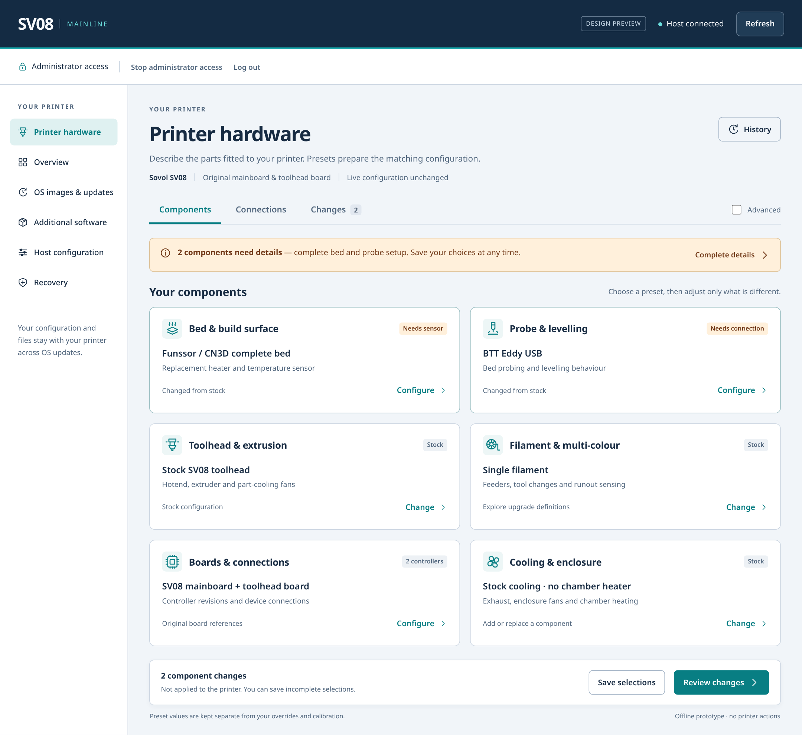
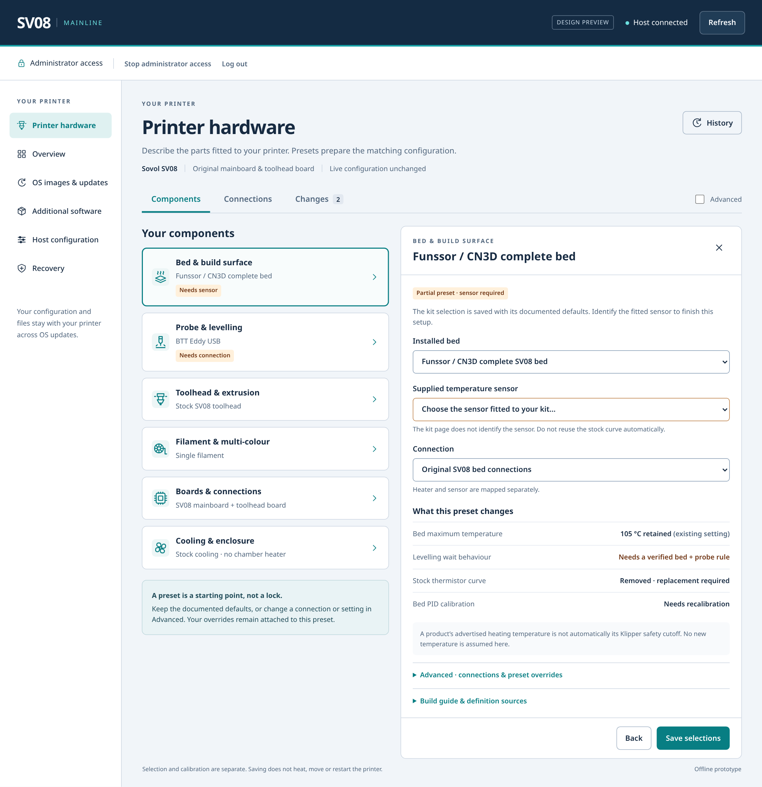
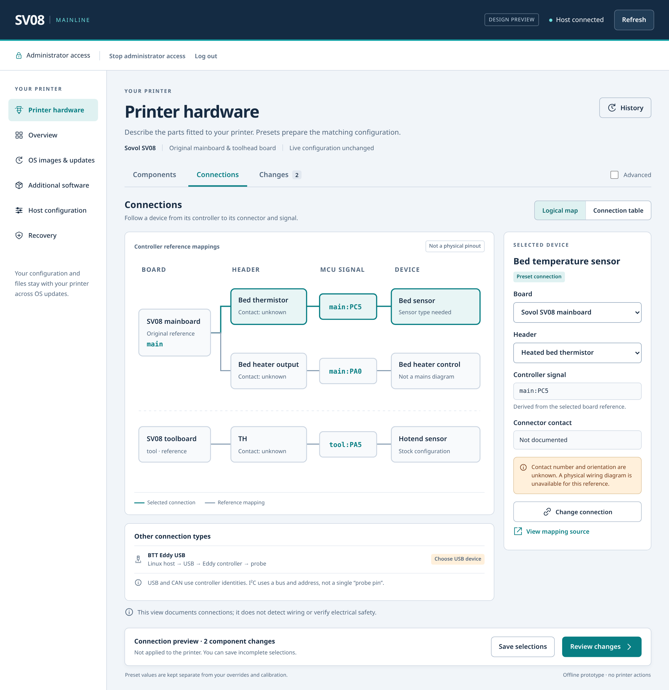
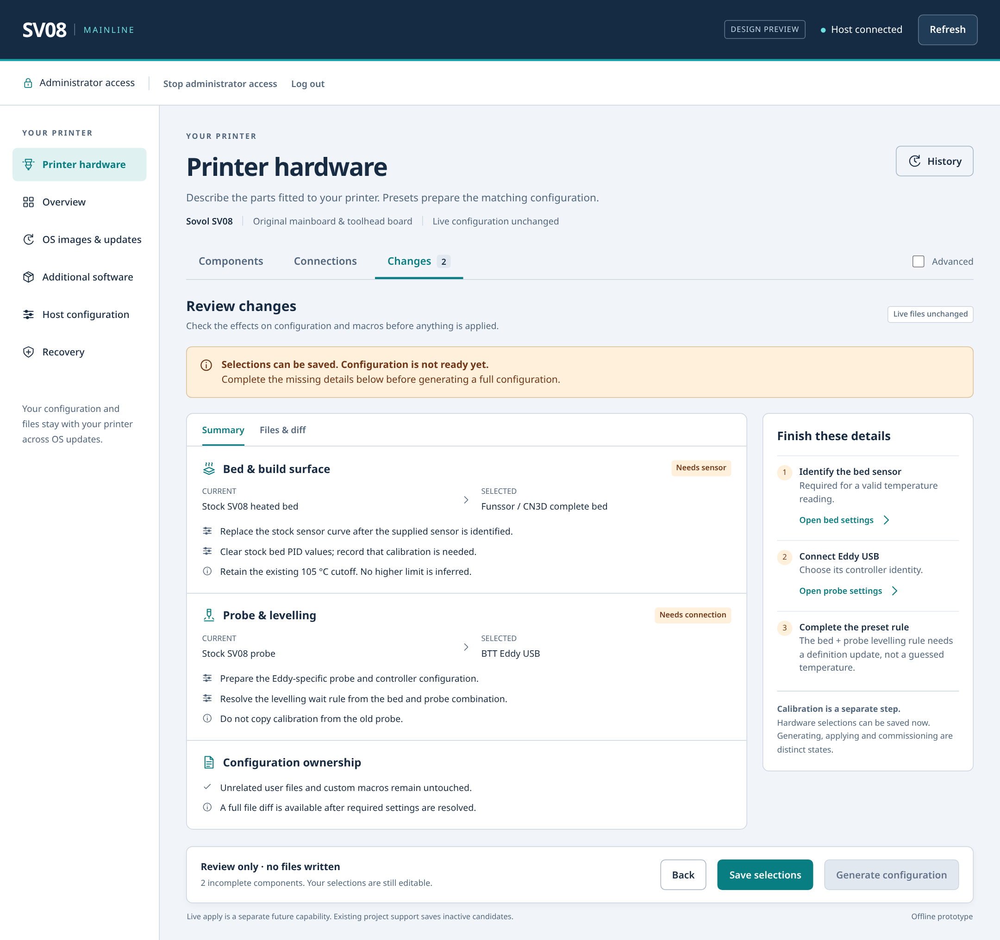
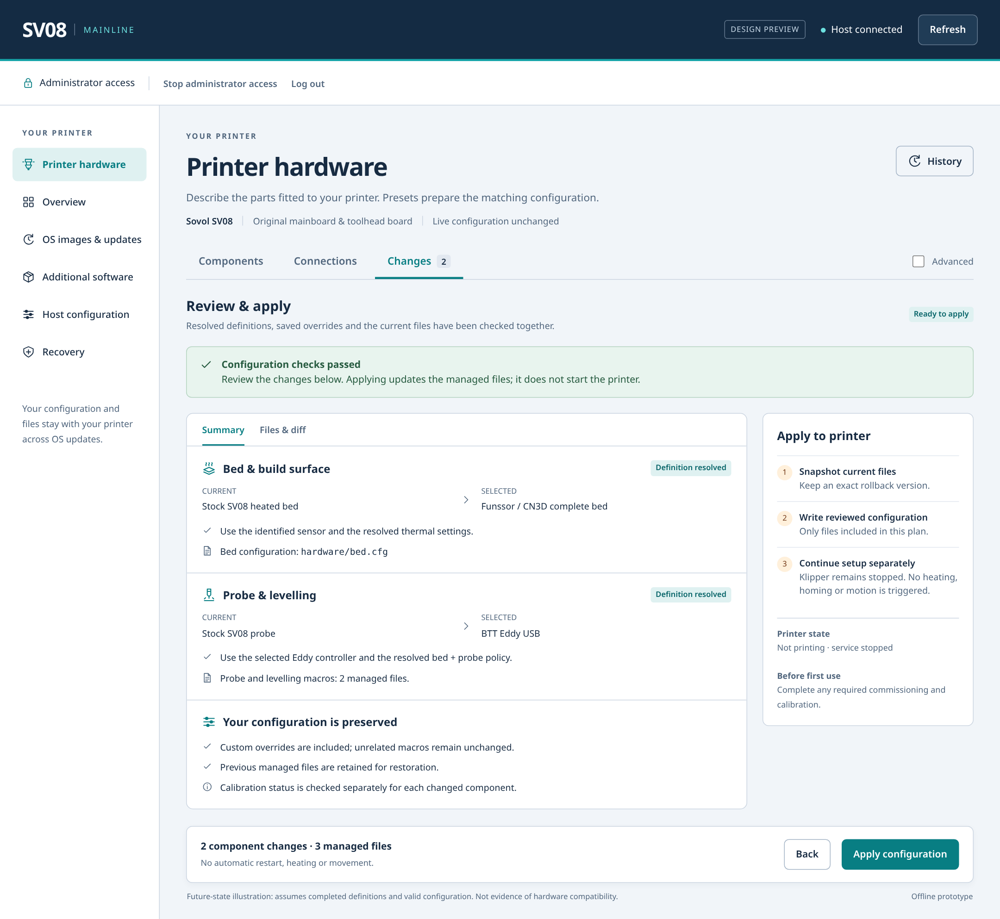

# Printer hardware page — design brief

**Project:** sv08-mainline  
**Status:** Owner-selected implementation requirements; delivery evidence remains separate  
**Prepared:** 6 October 2026  
**Revision:** 0.2 — creator-published definition sources added  
**Target:** The existing SV08 Mainline Cockpit host-administration interface, `#printer`  
**Repository baseline inspected:** `main` at `11912e05c7a14650cc7a0c486e40482da9241760`

## 1. Purpose and recommended direction

Let a user describe **what is fitted to their printer**, rather than reconstruct its configuration by hand. A maintained definition of each supported upgrade should supply the documented configuration, connections, dependencies and macro behaviour. The user adjusts only what differs from that definition, reviews the result and applies it through an explicit configuration workflow.

The main interaction should be:

> Open **Bed & build surface** → choose **Funssor / CN3D complete bed** → answer any genuinely missing questions → review the configuration and macro changes.

The same model should support BTT Eddy, CN3D toolheads, multi-colour systems, replacement boards and custom assemblies. Selecting a kit must be capable of changing several related devices and files, not just filling one dropdown.

**Recommended design:** a component-first page, a contextual detail panel, a logical connection map and a separate changes review. **Definition sources** lets the owner add creator/third-party GitHub catalogues, whose presets appear alongside built-in choices. Keep the existing Cockpit shell and SV08 branding. Do not introduce a separate printer application, a photorealistic hardware catalogue or an electronics-CAD workspace.

The finished product includes controlled application to the printer. The first implementation may retain inactive-candidate output while that backend is developed, but **saving an inactive candidate is not the completed product goal**.

## 2. Inputs and existing project constraints

This proposal incorporates the original request, its MHTML attachment, the Cockpit/Markdown clarification, the subsequent creator-repository requirement and a read of the live repository. The original requests and attachment are preserved in [Appendix A](#appendix-a-original-requirements-and-reference-capture).

### 2.1 What the attachment shows

The supplied page is already inside the SV08 Mainline administration shell. It has a navy masthead, teal accents, a white sidebar, light-grey content background and white panels. The confusing part is the printer form, not the branding.

The current information hierarchy leads with board selection and then mixes assemblies, sensors, additional devices, source provenance, electrical parameters, calibration and candidate management. A bed and its sensor appear in several places. Selecting an upgrade still exposes the internal modelling to the user. Repeated uncertainty explanations occupy space that should help the user choose a component.

**Preserve the underlying distinctions; stop making the user navigate all of them at once.**

### 2.2 Verified implementation baseline

| Existing capability or constraint | Design consequence |
| --- | --- |
| The printer panel is composed into the host shell, with one header, sidebar and authorization session. | Redesign the panel in place. Preserve host navigation and draft continuity. |
| `ui/printer/panel.html` and `scripts/stage_printer_ui.py:compose_host` participate in that composition. | Reuse those integration points rather than creating another shell or iframe. |
| The catalogue and generator already support structured devices, board references, named presets and incomplete saved drafts. | Evolve the existing data and persistence model rather than inventing parallel storage. |
| Current apply saves an **inactive configuration string**; it does not edit live `printer.cfg` or restart services. | Do not relabel that operation “Apply to printer”. Live application needs a separate backend capability. |
| Current generation does not provide arbitrary user text/includes or automatic homing/start macros. | Macro composition and advanced custom text are deliberate extensions, not existing features. |
| Loaded-context identity, revision checks, draft preservation and private MCU identity handling already exist. | Retain their behaviour while simplifying the presentation. |

Sources: [shared-panel design][repo-panel], [hardware catalogue and generation design][repo-catalog]. The repository documentation identifies the selected integration as Cockpit 337; that is the inspected project baseline, not a claim about the latest upstream release.

The files under `configs/host-os/cockpit-branding` primarily style the login surface. In particular, `branding.css` targets `body.login-pf`. The attached **host page stylesheet** is the additional reference for the in-session layout. Copying login CSS alone would not reproduce the page. See [repository branding][repo-branding] and the supplied capture.

### 2.3 Product goals versus incidental current restrictions

The current board-first layout, destructive clearing on board change and inactive-only generation are not UX goals to preserve indefinitely. They can be redesigned where their underlying protections are retained.

Conversely, incomplete drafts, explicit review, preserving unrelated configuration and distinguishing a reference mapping from verified physical hardware remain useful. A simpler page should not achieve simplicity by silently guessing missing facts.

## 3. Design principles and boundaries

**Describe components first.** “Which bed did you fit?” comes before “Which MCU pin provides its ADC input?” Show the boards in a compact summary; ask for board identity only when unknown or relevant to a change.

**Preset selection prepares changes; it does not immediately deploy them.** A selection should update the local draft and its effects immediately. No configuration write, firmware flash, restart, heating or movement occurs because a dropdown changed.

**Use progressive disclosure.** Show the selected component, its status and a clear action. Put technical defaults, source lines, pin details and custom text inside the corresponding component or Advanced view.

**Explain differences, not the entire catalogue.** A known, complete combination should require little input. Incomplete, incompatible and custom combinations should identify the particular missing fact or conflict.

**Make automation explainable.** Every generated setting or macro change should be attributable to a selected definition, a composition rule, calibration or a user override.

**Do not make setup a safety questionnaire.** Publish good definitions once. Do not ask every user to re-audit them. Reserve additional confirmation for changed safety-relevant limits, uncertain wiring, destructive replacement, commissioning and other consequential actions.

Out of scope for this page: print-job operation, live manual heater/motion controls, automatic firmware flashing, a central marketplace, cloud-dependent configuration generation and a complete physical wiring CAD tool. Software or firmware prerequisites may be reported and linked to their own workflow.

## 4. Page structure and visual language

### 4.1 Keep the existing host shell

Retain the SV08 / MAINLINE wordmark, host status, authorization controls and host sidebar. **Printer hardware** remains the selected host section. The other sections remain Overview, OS images & updates, Additional software, Host configuration and Recovery.

The panel adds three local views:

| View | User question | Main content |
| --- | --- | --- |
| **Components** | What have I installed? | Component cards and preset detail panel. |
| **Connections** | How is it connected? | Logical map, equivalent connection table and connection editor. |
| **Changes** | What will this do to my configuration? | Semantic changes, actual file diff, validation and application status. |

**Definition sources** is a secondary toolbar action, available without Advanced. It manages built-in and user-added repositories within the same shell; it is not a fourth primary tab. See [the source-distribution design](printer-definition-sources-design.md) for its proposed layout and workflow.

**Advanced** reveals additional controls within these views. It is not another data model and must not discard overrides when switched off. Keep History and import/export under a secondary action rather than making them part of the everyday selection form.

### 4.2 Component sections

| Section | Contents | Outline icon concept |
| --- | --- | --- |
| **Bed & build surface** | Bed assembly, heater, sensor, plate and documented geometry changes. | Heated plate. |
| **Probe & levelling** | Probe, mounting variant, homing/levelling policy and associated calibration. | Probe tip and surface. |
| **Toolhead & extrusion** | Toolhead assembly, hotend, extruder, nozzle and local fans. | Nozzle/toolhead. |
| **Filament & multi-colour** | Runout sensing, feeders, switching, toolchanger system and tool count. | Spool and filament path. |
| **Boards & connections** | Main, toolhead and auxiliary controllers, revisions and transport identities. | Circuit board. |
| **Cooling & enclosure** | Exhaust, enclosure fans, chamber sensors and heating modules. | Fan. |

Motion, motors and endstops must remain accessible. Initially place their detailed assignments in **Boards & connections → Motion & endstops**. Promote them to a seventh card if user testing shows frequent motion-upgrade work; do not simply remove existing capabilities to achieve a six-card layout.

Each card shows an icon **with a text heading**, the selected assembly or a short summary, one meaningful status and a Change/Configure action. Cards are component summaries, not product advertisements. Use a single-select list for mutually exclusive replacements; use checkboxes or add/remove controls only for genuinely additive devices.

The detail panel contains searchable choices with exact product/revision labels. Search should accept useful aliases, including the user's “Funnsor” spelling, while displaying the manufacturer's “Funssor” name. A kit that affects multiple sections is selected once and appears as the owner of its related devices elsewhere. Built-in and externally sourced choices share this selector, with source/version attribution and an optional source filter. Identical display names from different publishers never imply replacement or equivalence.

### 4.3 Theme and feasible implementation

Use the existing visual tokens:

| Role | Reference value |
| --- | --- |
| Masthead | `#142b43` |
| Primary action / selection | `#087e83` |
| Masthead accent | `#17a4a8` |
| Selected pale-teal surface | `#dff1f1` |
| Main text | `#172b42` |
| Secondary text | `#52677e` |
| Page background | `#f1f5f9` |
| Panel background | `#ffffff` |
| Borders | `#cbd5e1` |

Use the existing system-font approach, restrained borders, moderate corner radii and conventional buttons, forms, tabs, details and tables. No neon treatment, product photography, 3D renders of components or invented Cockpit logo.

The included icons are original outline SVGs, not downloaded Flaticon assets. The Flaticon link is a **style reference**, not an asset dependency or permission to redistribute an icon set.

Cockpit supports custom modules, and PatternFly documents cards and inline drawers; those establish that the proposed patterns are ordinary web-interface patterns. They do not supply a printer configurator or a wiring map automatically. Reuse the existing HTML/JavaScript/CSS implementation where practical. A React or PatternFly dependency migration is not required solely to obtain this layout. Scope panel styles so they do not alter other host pages. Sources: [Cockpit][cockpit], [cards][pf-card], [drawers][pf-drawer].

## 5. Screen behaviour

### 5.1 Components overview

The default view answers three questions immediately: what is selected, what changed, and what still needs attention.

A normal complete configuration should not show a permanent warning banner. When needed, use one concise summary such as **“2 components need details”**, with links into the affected components. Distinguish:

- **Needs your input:** for example, which supplied thermistor was fitted.
- **Definition incomplete:** a missing guide-derived rule that the catalogue author must resolve.
- **Conflict:** two selected components claim an incompatible resource or behaviour.

These are different problems. Do not turn missing catalogue research into an unexplained request for the user to choose a temperature.

The footer shows pending component changes, **Save selections** and **Review changes**. Saving is allowed before calibration or completion. Review remains accessible when blocked so the user can inspect why. A Changes badge counts changed components, not generated files or unresolved questions.

### 5.2 Component detail panel

Open an inline detail panel on sufficiently wide displays. Keep a compact list of components alongside it so the user's place is visible. On narrow screens, show the detail as the main panel with an explicit Back action, rather than squeezing two columns.

Order the content as follows: selected preset and variant; essential unanswered questions; concise effects; optional connection changes; Advanced; build-guide and definition provenance. Prefer an already selected documented default to an empty field when the definition genuinely supplies it.

Show values with their origin and status: **Preset**, **Your override**, **Calibration**, **Existing setting retained** or **Unknown**. The effective value must be inspectable. “From preset” alone is insufficient in the detailed review of an actual thermal or motion setting.

Reset is field-specific or component-specific. Resetting a fan override must not reset the bed, MCU identity or unrelated custom macros. Replacing an assembly previews affected devices, settings and calibration before the draft changes are committed.

### 5.3 Connections

The initial map is a **logical connection view**, not a board photograph:

```text
Controller/board → connector/header → contact and MCU signal → device terminal
```

Where contact numbering is not documented, show **Contact unknown** while retaining a source-backed logical signal mapping. Do not draw numbered pins or connector orientation from guesswork. Unknown physical contact numbers need not prevent an otherwise valid reference configuration from being saved or generated; they do prevent presenting a complete physical pinout or authorizing a remap that depends on those unknown facts.

Clicking a device or connection highlights its path and opens the inspector. The inspector chooses a board revision and a compatible connector/function, then derives the signal. Advanced users can choose a documented alternative or define a custom board/connection with explicit provenance. A connector choice should not ask a user to retype the same GPIO.

The equivalent table is a first-class editing path, not a debug dump. It supports keyboard use, filtering, multi-device inspection and small displays. Wiring by drag-and-drop may be added later, but must never be the only way to edit a connection.

A future physical pinout view can use simple schematic outlines with connector positions only after exact board-revision, numbering and orientation data exist. It must carry a viewing-side label and a clear pin-1 reference. This is optional enrichment of the same model, not a separate wiring database.

### 5.4 Changes and application

Present the semantic change first: **“Stock bed → Funssor / CN3D bed”**, followed by its settings, macro effects, calibration consequences and conflicts. Provide an actual before/after file diff when a complete candidate exists. Do not display a made-up diff for unresolved values.

Allow grouping by component and by file. Show creates, updates, removals, retained overrides, affected calibration and the reason for each change. Highlight an unexpected touched file. The user should be able to answer **“Why is this line changing?”** without reading generator code.

The current backend action is labelled **Save generated configuration**, with **Inactive** status. Once the live-deployment backend exists, the final action may be **Apply configuration**, accompanied by its exact service/restart behaviour. Do not report **Ready to print** merely because files were saved or the parser accepted them.

The resolved-state render illustrates a future application flow that leaves Klipper stopped. It assumes complete definitions and a valid candidate; it is not evidence that the pictured hardware combination has been validated.

## 6. Required user journeys

### 6.1 Funssor / CN3D bed, guide-standard installation

Open the bed section, choose the exact kit and revision, and keep its documented connection defaults. The definition supplies all established sensor, heater, geometry and behaviour changes. Ask only about items not established for that kit, such as its supplied thermistor. Show configuration and macro effects together and save the selection even when incomplete.

**Known gap:** the inspected project evidence says the selected complete-bed page did not identify the thermistor. The current profile clears the old sensor curve and PID values and retains the existing 105 °C software cutoff. The manufacturer's page advertises 120 °C heating and a 135 °C fuse, but these are not interchangeable with a software cutoff or proof of a safe setting for the fitted system. The brief therefore does not invent a replacement maximum or a levelling temperature. Sources: [named-upgrade evidence][repo-upgrade], [manufacturer page][bed-product].

When a verified definition supplies a new maximum or levelling rule, selecting that definition should populate it automatically. The current source gap is not a reason to design a permanent manual-temperature workflow for all users.

### 6.2 Bed plus Eddy

Select the bed and then the exact Eddy variant. The combined selection resolves one levelling policy; it must not concatenate two competing replacements of the same macro.

Do not treat “BTT Eddy” as one pin-compatible device. The manufacturer's guide distinguishes Eddy USB from Eddy Coil and describes the Coil's toolboard I²C connection. A different Eddy model requires its own documented definition. Upstream Klipper's Eddy documentation also makes calibration and thermal behaviour relevant. Use the project's pinned Klipper capabilities, not just the newest documentation. Sources: [Eddy guide][eddy-guide], [upstream Eddy documentation][eddy-klipper].

For USB, choose the controller's device identity rather than a mainboard probe pin. For Coil, choose the appropriate I²C bus and supported connections. Variant changes invalidate affected connection and calibration assumptions. Mount-specific offsets belong to the mount definition or measured calibration, not the generic product name.

### 6.3 CN3D toolhead or multi-colour upgrade

Select an exact versioned build, then select required variants: hotend, extruder, board, probe mount and any feeder/cutter/sensor options. A bundle may replace or add several devices and macro behaviours. Show that bundle's effects once, with its ownership visible in the affected cards.

Keep **multi-colour feeder systems** and **multiple physical toolheads/toolchangers** distinct. They can require different tool counts, offsets, homing/docking constraints, sensors and tool-change macros. Do not ship a generic “CN3D multi-colour” switch with guessed configuration.

Specific CN3D toolhead and multi-colour guide revisions remain catalogue-research work. Their inclusion here is a requested product capability, not a claim that those presets already exist or are validated.

### 6.4 Different connector or board

The user selects a supported preset, then changes a connection in Advanced. The application resolves the new board/header/signal, identifies any capability conflict and records a local override. All compatible settings and unrelated components remain intact.

Changing a board proposes a **remapping plan**, not an immediate blanket deletion: preserve semantic devices, remap only established equivalents, mark unresolved bindings, clear the old controller identity and invalidate board-dependent values. Provide a discard/clear option, but do not make destructive clearing the only long-term workflow.

### 6.5 Preset update, removal and existing manual configuration

A new definition version is offered as a reviewable update, never silently substituted. Compare the old definition, new definition and local override. Keep or reset each override deliberately.

Removing an upgrade removes only its owned contributions and recomputes shared dependencies. Removing one kit must not remove a probe still used elsewhere. Restoring “stock” means choosing a versioned stock definition, not blindly replaying a historical file.

On first use with existing configuration, inventory it before generating replacements. Mark selections as detected, imported, user-declared or unknown. Do not label an unknown printer stock. Unrecognised macros and calibration must remain preserved and visible as unmanaged until explicitly adopted.

### 6.6 Add a creator's definitions

Open **Definition sources → Add repository**, paste the creator's GitHub URL, inspect the resolved source and confirm. Its supported presets become available in the relevant component sections. A one-definition repository and a collection use the same mechanism. No upstream sv08-mainline contribution is required merely to publish a supported definition.

Selecting a preset pins its exact content and dependencies. Repository updates are offered separately; they do not change selections, overrides or live files. Disabling/removing a source stops future discovery but retains definitions referenced by the current printer, drafts and restoration snapshots. See [Creator-published printer definitions](printer-definition-sources-design.md).

## 7. Definition and printer-state model

### 7.1 Separate the things that change for different reasons

Use four related layers:

| Layer | Responsibility |
| --- | --- |
| **Component definitions** | Product identity, variants, capabilities, documented settings and required inputs. |
| **Board/connection definitions** | Exact board revision, headers, contacts, signals, capabilities, reservations and electrical information where documented. |
| **Upgrade bundles and composition rules** | Related component selections, compatible combinations, dependencies and shared behaviour. |
| **Printer instance** | What this user selected, physical controller identities, connections, overrides and calibration references. |

Do not bake mainboard GPIO values into a supposedly portable bed or toolhead definition. Define semantic endpoints such as `bed.temperature` and resolve them through the selected board/connection mapping.

A definition needs a stable ID and revision, display name and aliases, exact hardware scope, source references, compatibility requirements, settings, connections, outputs, calibration consequences and tests. Sources should identify the guide revision or snapshot hash and relevant section, page or timestamp. A commercial product page may establish kit identity without establishing every electrical or software value.

Distinguish source quality from installation state: a documented definition is not proof that this particular printer is wired to match it. Conversely, a user-confirmed connection does not turn an unsupported firmware capability into a supported one.

### 7.2 Illustrative schema shape

The following is a **non-loadable schema sketch**, not a real preset or an implementation-ready schema. It intentionally contains no invented thermal value, sensor identity or source revision.

```yaml
schema_proposal: printer-upgrade-v2
id: funssor-cn3d-sv08-complete-bed
revision: null                    # assigned when a definition is published
selectable_for_generation: false # source gaps remain in this sketch
component_role: bed
required_inputs:
  - fitted_temperature_sensor
connections:
  heater_control: bed.heater
  temperature_input: bed.temperature
behaviour_requirements:
  - levelling_policy_for_selected_bed_and_probe
outputs:
  - kind: klipper_settings
    target_role: heated_bed
  - kind: macro_policy
    target_role: levelling_preconditions
calibration_invalidation:
  - bed_pid
  - bed_geometry_dependent_calibration
unresolved:
  - verified_thermal_limit_for_exact_variant
  - guide_derived_levelling_rule
```

Keep actual definitions data-only. Adding another supported preset of an existing kind should be a catalogue and fixture change, not a new UI component or downloaded executable plugin. New device kinds, output adapters or behaviour capabilities can require bounded application changes.

### 7.3 Connection semantics

A logical endpoint may resolve to a single GPIO, a multi-contact connector, a bus or a controller transport. Model these honestly:

- GPIO and analogue connections include the MCU namespace, pin/function and relevant inversion, pull-up or circuit information.
- I²C/SPI connections include bus identity and address/chip-select requirements; shared buses are not exclusive single pins.
- USB/CAN controllers include transport identity, with local sensor signals belonging to that controller rather than the host's unrelated GPIO.

Validate canonical resources, not just labels: board instance + physical pin, bus/address, timer/function constraints where documented, connector role, polarity, supply/interface suitability and duplicate MCU identities. Two labels referring to the same pin are still a collision. Shared resources require an explicit sharing rule.

Retain physical device terminals separately from firmware signal names. A bed heater output in the mockup is a **control-path reference**, not an instruction for mains wiring. Missing electrical ratings stay unknown. No visual connection should imply electrical compatibility merely because two boxes can be linked.

### 7.4 Bed/probe behaviour is a policy, not one temperature field

Represent the purpose of each condition. At minimum distinguish bed warm-up target, an upper temperature allowed for a contact operation, probe thermal conditions, heat-soak duration and the phase of the levelling process in which a wait occurs.

A wait rule needs its sensor/temperature source, comparison (`at_least`, `at_most`, `within_range`), threshold or parameter reference, tolerance where applicable, timeout and abort behaviour. Its definition must state whether it heats, waits for cooling or only checks a condition. The application must never turn a cooling prerequisite into a heating command by interpreting an ambiguous “levelling temperature”.

Compose those requirements from bed, probe, toolhead and supported process definitions. Reject contradictory requirements rather than applying whichever preset was selected last. A combination can also explicitly state that no additional wait is required; absence of data is not equivalent to that statement.

### 7.5 Public schema and external definition sources

Publish one versioned public definition format for built-in, creator-published and local definitions. The existing internal catalogue schema is a starting point, not an obligation to expose private storage or board-first UI structure. The fuller [public-contract and source-loader design](printer-definition-sources-design.md) specifies the contract, contributor workflow, identity, updates and validation.

Use JSON Schema Draft 2020-12 for published JSON; offer optional YAML-to-JSON authoring tools outside the printer. Provide schemas, field documentation, examples and a validator together. Common metadata plus supported component, board, assembly and behaviour records permit new presets without application changes. Unknown required behaviour/capabilities remain explicitly unsupported rather than being ignored. Namespaced descriptive extensions cannot modify printer behaviour.

A conventional `catalog.json` indexes one or many definition files in a creator repository. User-added public GitHub sources are the initial distribution path. The importer resolves an exact commit, fetches only indexed bounded data, validates it and publishes a local cache. It never executes repository code or installs software. Both external and built-in presets enter the same composition pipeline.

Keep source identity distinct from author-supplied names. Each selected record retains its source, ID, version, content digest, repository commit and resolved dependency closure. Another repository cannot shadow a built-in or win a conflict merely because it appears first. Cross-source prerequisites are explicit and never silently add a subscription.

Keep **source addition**, **catalogue refresh**, **selected-preset update** and **configuration application** distinct. A complete locked selection works offline. Removing a source preserves referenced content; an OS/catalogue update does not silently change the built-in dependencies of an external preset. Review updated defaults against local overrides and calibration before adopting them.

The data-only boundary reduces installation risk but does not certify heater limits, pin maps or macros. Prefer typed behaviour hooks. Raw macro support is an explicit advanced capability with managed ownership and non-live validation, not a loophole in an arbitrary-text field. Do not freeze complex upgrade support out of the long-term design merely because the first loader supports a narrower vocabulary.

## 8. Configuration and macro composition

### 8.1 Deterministic resolution

Resolve in this order: base printer definition; selected components/bundles; board bindings; combination rules; user overrides; valid component-bound calibration. Enforce invariants across the effective result. This is **not** a general last-writer-wins rule: competing writers, duplicate sections and ambiguous macro ownership are conflicts.

Generate the same output from the same resolved inputs. Selecting A then B should produce the same result as selecting B then A. Repeating generation should not append another include or duplicate a macro. Pin the definition and generator versions in a local manifest so the result is reproducible without live web access.

### 8.2 Settings and macros share one source of truth

A preset may create or update Klipper sections, macro parameters, macro definitions and a controlled include graph. The user should not have to repeat one temperature across several files manually.

Prefer parameterising stable project-owned macros or invoking named policy hooks over giving each upgrade a full competing copy of `PRINT_START`, homing or bed-mesh macros. Define ownership of macro names and `rename_existing` chains. Explicitly identify any vendor-guide behaviour that depends on an unsupported fork or extension; do not install it silently.

Klipper provides configuration includes and Jinja-based G-code macros; that syntax is not a merge or compatibility mechanism. The composer still needs semantic ownership and tests. Sources: [Klipper configuration reference][klipper-config], [command templates][klipper-macros].

### 8.3 Meaning of “any configuration or macro file”

The goal is not a single hard-coded output file. Definitions should describe a change set spanning all supported printer configuration and macro files. Implement that through typed, allowlisted output adapters, initially Klipper configuration/macros. Additional formats need explicit adapters and ownership rules.

It does **not** mean that a downloaded definition may modify arbitrary host files or execute installation scripts. Output destinations must be constrained to approved printer configuration locations, with path traversal, unexpected links and command execution refused.

Illustrative output groups in the mockups are `hardware/bed.cfg`, `hardware/probe.cfg` and `macros/hardware.cfg`. Those are proposed presentation names, not existing repository paths or already-generated files.

### 8.4 Preserve user edits and calibration

Keep definition-managed configuration, user-owned additions and calibration logically distinct. Preserve unrelated files and unknown sections. Before touching an existing section, compare the last generated base, the current file and the new result. Present conflicts rather than overwriting manual edits.

Klipper's `SAVE_CONFIG` output is another writer. Preserve and account for it, and invalidate only calibration whose dependency fingerprint changed. That fingerprint may include device instance, sensor definition, board/binding, mount geometry and relevant method/firmware version. Do not erase all calibration merely because an unrelated fan or comment changed.

## 9. Advanced mode

Advanced mode has two levels.

**Structured overrides** are the normal expert path: alternate connector, pin/function, sensor curve, named setting, offset, macro parameter or supported process rule. Show inherited value, effective value and origin together. Resetting an override restores the current definition value; updating a preset does not silently erase the override.

**Custom configuration** supports a genuinely different toolhead, board, section or macro. Provide an explicit user-owned section/file editor and an ownership transfer action where necessary. Do not create a duplicate section and hope include order will resolve it. A custom board must declare the required mappings/capabilities; raw pin text is not enough to validate a new circuit.

Parse and check what can be checked, preserve unknown text and clearly identify the limits of validation. Arbitrary Jinja/G-code cannot be certified safe by a simple static parser. Custom motion, heating and homing behaviour needs an appropriate commissioning path. Do not hide custom content or relax protections just because Advanced is enabled.

Existing generation currently rejects arbitrary text/includes. Adding this editor therefore requires a scoped backend extension and ownership design. It is part of the requested end state, not something the current generator can be assumed to accept.

## 10. State, saving and controlled application

### 10.1 Name states precisely

```text
Local edits → saved selections → resolved/validated candidate
            → applied configuration → commissioned printer
```

Also report partial selections, conflicts, drift, unsupported definitions and a previous configuration available for restoration. Calibration is tracked per component and can remain pending after selections are saved. “Configured” should mean an identified state, not a generic green tick covering every stage.

**Save selections** persists the user's description. **Generate configuration** creates a validated inactive candidate when its requirements are satisfied. **Apply configuration** changes the live managed configuration only when that feature is implemented and its preconditions are met. **Commission/start** is separately authorized where required.

### 10.2 Future apply transaction

The application must bind the review to exact input, catalogue/generator versions, current file hashes and host context. At apply time, recheck under the existing coordinated locking model. Refuse stale reviews, unexpected edits, uncertain earlier acknowledgments, active printing and insufficient storage before publishing.

Stage and validate the entire resolved output; retain an exact restoration snapshot and an operation receipt. Prefer an immutable managed bundle with a single controlled activation point if it fits the current persistent configuration view. Otherwise design journaled publication and recovery explicitly. Several individually atomic file renames do not make an all-or-nothing transaction. Do not introduce new symlinks into locations where the current store intentionally refuses them without a reviewed storage change.

The initial live-apply design should leave the printer service stopped. Do not implicitly run macros or restart into potentially active startup behaviour. Later support for apply-and-restart must disclose the effect and require the corresponding readiness checks. A service reaching `ready` is software evidence, not proof of a safe physical installation.

If publication or subsequent startup fails, report which configuration is active and which service state is known. Offer restoration with a preview. Restoring files must not automatically re-enable heating/motion, and a prior configuration may no longer match newly fitted hardware.

### 10.3 Commissioning without circular dependencies

Changing a heater or probe may invalidate calibration that full generation needs. Do not copy stale values just to make the candidate parse. Define a separate constrained commissioning configuration/workflow where needed, or explicitly hand off to the existing commissioning process. It must permit only the intended sensor or calibration actions under its own authorization.

This is an engineering requirement of end-to-end setup, not a reason to stop users saving a hardware description. The exact integration belongs in the live-apply/commissioning work package.

## 11. Accessibility, responsiveness and operating constraints

Target the existing desktop browser use and the project's **1024 × 600** display. At that small landscape size, reduce secondary header/context text and keep readable controls; allow vertical scrolling rather than shrinking the whole desktop page. Preserve access to Save and Review without covering the final fields or preventing focus from scrolling into view.

At narrow phone widths, stack component cards, use a single detail panel and offer the connection table or focused device view. A schematic may scroll inside its own region; the page itself must not gain horizontal overflow. At 200% zoom, switch layouts rather than overlapping columns.

Use visible text with icons, keyboard-operable selection, focus restoration, labelled inputs, non-colour-only status, accessible errors and appropriately sized touch targets. Native detail disclosure is acceptable. A modal must have focus management; an inline non-modal drawer must not trap the whole page.

Reuse Cockpit authentication and authorization. A read-only session can inspect the current state and preview changes but cannot publish them. Preserve in-memory edits during local navigation and clearly reconcile after disconnect, another tab's changes or authorization transitions. Keep MCU identities out of URLs, catalogue files, logs and browser persistent storage. Redact them from shareable exports unless the user explicitly requests a private backup.

Presets and icons must work offline. Fetching or updating definitions is a separate explicit action, never a prerequisite for opening the page. Do not ship these design PNGs or the prototype as runtime assets. Measure changes against the existing appliance package/storage budgets; avoid a heavyweight graph library for a small logical map.

## 12. Alternatives considered

| Approach | Benefit | Problem / decision |
| --- | --- | --- |
| One long form, grouped more neatly | Smallest UI change. | Still exposes backend concepts and duplicate component/sensor editing. Not recommended. |
| Mandatory setup wizard | Useful for a new, unknown printer. | Slow for an existing owner changing one component. Use a short optional intake, not the permanent interface. |
| Product catalogue with images | Familiar shopping pattern. | Poor fit for administration, revisions and connection details; explicitly rejected by the owner. |
| Full visual wiring canvas as the home page | Powerful for custom electronics. | Unnecessarily complex for selecting a documented bed kit. Defer free-form editing. |
| Component cards + details + logical connections + review | Quick normal path, room for exceptions, fits the current shell. | Requires a sound composition model behind the UI. Recommended. |

## 13. Delivery plan and acceptance criteria

### 13.1 Incremental delivery

**Stage 1 — panel redesign and migration.** Replace the information hierarchy, not the host shell. Deliver cards, contextual editing, Advanced, semantic review and a logical map/table for existing reference mappings. Preserve existing draft imports, incomplete saves, private identities, catalogue behaviour and inactive output. Add a versioned migration with preview/backup; do not infer a stock state from missing legacy data.

**Stage 2 — definition-driven composition.** Add board-independent component definitions, versioned bundles, combination policies, macro outputs, scoped overrides and dependency-aware removal/update. Resolve the missing Funssor bed facts and implement one exact Eddy variant as a tested end-to-end combination. Expand to specifically researched CN3D builds rather than broad brand-level placeholders.

**Stage 2a — public definitions and creator sources.** Publish the shared schema/contract, examples and creator validator; adapt built-ins to that format. Add GitHub catalogue import, unified component choices, namespaced identity, pinned dependency snapshots, offline cache and explicit update/removal handling. This can run against inactive generation and should not wait for live deployment. See the [source-distribution acceptance criteria](printer-definition-sources-design.md#11-delivery-sequence-and-acceptance).

**Stage 3 — controlled application and commissioning.** Add managed-file ownership, drift reconciliation, complete-output validation, snapshots, recoverable publication, service-state handling and the commissioning handoff. Only then expose live Apply. Custom raw configuration requires its own ownership and validation extension.

**Later, based on demonstrated need:** physical connector layouts, drag-to-connect editing, richer multi-tool visualisation and additional configuration formats. These should not delay a useful preset-selection page.

### 13.2 Testable acceptance criteria

| Area | Acceptance test |
| --- | --- |
| Normal selection | With a complete supported definition, select and review an upgrade without opening Advanced or manually editing files. |
| Usability target | A user familiar with the fitted hardware can select and review a complete preset in roughly one minute, excluding research, calibration and physical work. Validate through observation, not assumption. |
| Bed + probe composition | Changing selection order produces identical effective settings/macros; no duplicate levelling macro or include appears. |
| Partial definitions | Incomplete selections save and reload. Unknown sensor/rule data are not generated as guessed values. User-input gaps and catalogue gaps are labelled differently. |
| Connection override | Remapping a supported connection updates only dependent outputs and retains preset identity. Aliased-pin collisions and incompatible endpoint types are rejected. |
| Board replacement | A preview shows preserved, remapped and unresolved connections before change; unrelated controllers remain unchanged. |
| User configuration | Unrelated text and files remain byte-preserved where not owned. Manual-edit and duplicate-section conflicts require resolution. |
| Calibration | A bed/probe change invalidates the relevant calibration; an unrelated fan change does not. `SAVE_CONFIG` changes are included in drift checks. |
| Preset update/removal | Local overrides survive review; shared dependencies are reference-aware; removal does not erase unrelated macros. |
| State and concurrency | Navigation retains edits. A stale tab cannot apply a previously reviewed payload after another writer changes state. Lost acknowledgment is reconciled, not blindly retried. |
| Live apply | No selection/save action touches live files. Future application refuses unsafe operating states and survives injected write/startup failures without falsely reporting success. |
| Output validation | Test generated configuration and macro integration against pinned project dependencies. Parsing is not presented as proof of hardware safety. |
| Presentation | Test keyboard, touch, 1024 × 600, narrow mobile and 200% zoom. No page-wide horizontal overflow or inaccessible final controls. |
| Offline/privacy | Viewing and generation from a retained locked plan need no network fetch. Explicit source addition/update may use the network. Public exports do not leak MCU identities. |
| Creator publication | A supported new definition can be published in an external repository without an application patch or central approval. |
| Source addition | Add a repository once; supported entries appear in the existing selectors without altering selections or live files. |
| Source identity/updates | Source IDs cannot shadow built-ins; updates retain pinned old content and preserve overrides for review. |
| Source removal | Removing a subscription preserves definitions referenced by drafts, active configuration and retained restoration snapshots. |

Unit/fixture tests should handle routine definition and UI changes. Focus deeper engineering review on new electrical mappings, heater/motion behaviour, custom macro execution and live publication. Do not require a new independent approval ceremony for every ordinary user selection of an already-supported preset.

## 14. Decisions still to settle

The following questions affect implementation, not the basic visual direction:

1. **Initial supported builds:** which exact CN3D toolhead/multi-colour revisions and which Eddy variants should follow the first bed + Eddy combination?
2. **Bed-source gaps:** what identifies the supplied thermistor, the applicable thermal cutoff and the intended levelling phase/temperature rule for the owner's actual kit?
3. **Macro ownership:** which existing project controls become stable parameterised hooks, and which must remain separately owned?
4. **Live activation boundary:** which existing runtime/configuration generation mechanism should own publication and the transition into commissioning?
5. **Motion editing prominence:** is motion/gantry modification common enough to justify a seventh card immediately?

Recommended defaults are already given above. These questions need not block a first UX prototype or the component-first redesign.

## 15. Interface renders and prototype

**Revision 0.2 scope:** the retained renders and HTML prototype illustrate the original component/connection/review design. They are unchanged and do not yet show the new Definition sources action or panel. Its proposed screen is documented as a text wireframe in the [source-distribution design](printer-definition-sources-design.md#2-user-experience-inside-cockpit); no source-loader implementation or new browser-render acceptance is claimed.

These are **browser-rendered HTML/CSS/SVG interfaces**, not a poster, product photography or generated pictures of hardware. They retain the supplied visual language. Fixture content is illustrative and does not represent a live read of the printer.

The first four screens intentionally show the unresolved bed-sensor situation found in the source material. The future resolved-state screen assumes those definition and installation requirements have been completed; it supplies no invented replacement temperatures or physical contact numbers.

### Components overview



### Selected bed preset



### Logical connections and inspector



### Review with unresolved details



### Future resolved review and application



Additional responsive renders: [1024 × 600 viewport](printer-hardware-page-design/05-components-1024x600.png) and [390 px mobile layout](printer-hardware-page-design/06-components-mobile.png).

Open [the self-contained prototype](printer-hardware-page-design/prototype.html) in a browser. Supported routes are `#components`, `#bed`, `#probe`, `#connections`, `#changes` and the separate illustrative `#ready` scenario. Navigation, Advanced disclosure, the connection table and file-plan view work. Other controls explain their intended behaviour. **No backend, real detection, persistent save, configuration generation or printer action is implemented by this prototype.**

[Render checks](printer-hardware-page-design/render-checks.json) record viewport sizes, page width and basic interaction checks. They establish only that the mockup rendered and its exercised interactions worked in the local Chromium harness. They are not Cockpit integration, accessibility, Klipper or hardware acceptance evidence.

## Appendix A. Original requirements and reference capture

The original requirements and capture were referenced by the imported brief, but
its `references/` files are absent from this checkout. They are not implementation
fixtures or usable links. The owner's explicit request selects this brief and its
companion as the implementation requirements. Retained PNGs and prototype are
visual references, never sources of hardware constants.

## Appendix B. Sources and provenance

Repository reads were pinned to the baseline SHA at the top of this brief. External pages were consulted on 6 October 2026 and are background/source leads, not substitutes for pinned implementation fixtures. Each released hardware definition still needs its own exact source coverage and compatibility tests.

| Reference | Use in this brief |
| --- | --- |
| [SV08 Cockpit branding][repo-branding] | Existing colour/branding intent and login-specific scope. |
| [Persistent printer panel][repo-panel] | Shared-shell integration, navigation and existing draft lifecycle. |
| [Printer hardware catalogue][repo-catalog] | Current structured presets, generation boundaries and persistence semantics. |
| [Named upgrade evidence][repo-upgrade] | Actual Funssor definition behaviour and unresolved sensor information. |
| [Funssor complete-bed page][bed-product] | Exact requested product; advertised thermal information is distinguished from configuration limits. |
| [Cockpit project][cockpit] | Custom-module platform, not a separate invented “Cockpit” product. |
| [PatternFly card][pf-card] and [drawer][pf-drawer] | Feasible component patterns; not a requirement to migrate frameworks. |
| [BIGTREETECH Eddy guide][eddy-guide] | Variant/transport distinctions and implementation source lead. |
| [Klipper Eddy documentation][eddy-klipper] | Calibration/temperature considerations and supported-feature source lead. |
| [Klipper configuration][klipper-config] and [macros][klipper-macros] | Output syntax and why macro ownership/composition must be explicit. |
| [Owner's outline-icon reference][icon-reference] | Visual direction only; no external icon assets included. |

[repo-branding]: https://github.com/drew442/sv08-mainline/blob/11912e05c7a14650cc7a0c486e40482da9241760/configs/host-os/cockpit-branding/branding.css
[repo-panel]: https://github.com/drew442/sv08-mainline/blob/11912e05c7a14650cc7a0c486e40482da9241760/docs/development/printer-cockpit-panel.md
[repo-catalog]: https://github.com/drew442/sv08-mainline/blob/11912e05c7a14650cc7a0c486e40482da9241760/docs/development/printer-hardware-catalog.md
[repo-upgrade]: https://github.com/drew442/sv08-mainline/blob/11912e05c7a14650cc7a0c486e40482da9241760/docs/features/printer-upgrade-profiles/evidence.md
[bed-product]: https://funssorlab.com/products/sovol-sv08-3d-printer-upgrade-hotbed-complete-kit-with-3d-printed-parts-design-by-nadircn3d-10mm-riser-heated-bed-upgrade-kit-120-240v-silicone-heater-01mm-flat-aluminum-bed
[cockpit]: https://cockpit-project.org/
[pf-card]: https://www.patternfly.org/components/card/
[pf-drawer]: https://www.patternfly.org/components/drawer/
[eddy-guide]: https://github.com/bigtreetech/Eddy
[eddy-klipper]: https://www.klipper3d.org/Eddy_Probe.html
[klipper-config]: https://www.klipper3d.org/Config_Reference.html
[klipper-macros]: https://www.klipper3d.org/Command_Templates.html
[icon-reference]: https://www.flaticon.com/free-icons?word=3d%20printer&shape=outline

Public-schema and source-distribution references are listed in the [companion design](printer-definition-sources-design.md#references), including current project schema/contribution guidance, official JSON Schema documentation, GitHub API behaviour and Klipper macro semantics.
