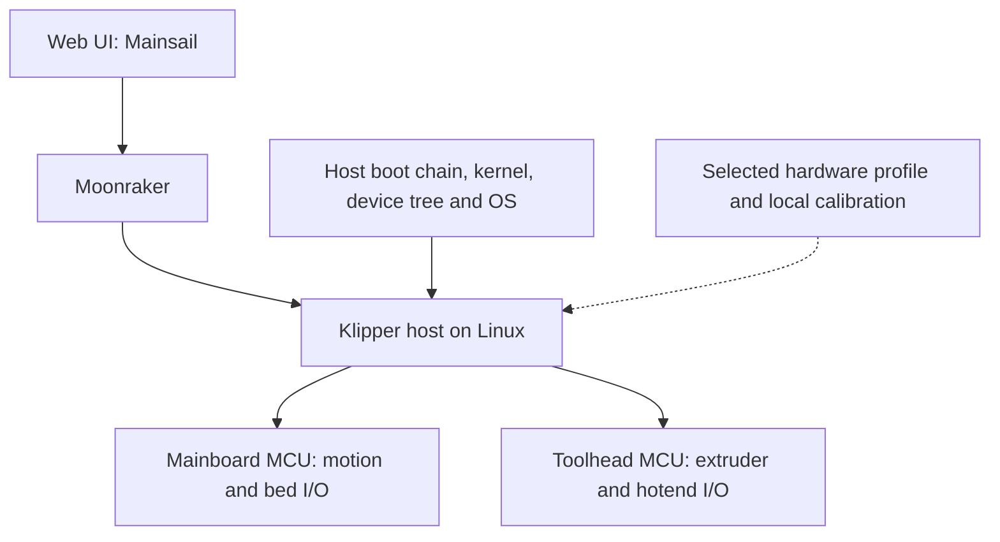

# Project definition

## Purpose

Make the Sovol SV08 maintainable on current upstream software and firmware.
Deliver a documented conversion path, reproducible artifacts, reliable operation,
and recovery procedures. Create custom code where a demonstrated compatibility
gap requires it, with the smallest maintainable divergence from upstream.

The audience is owners performing conversions, contributors implementing support,
and AI agents working in this repository.

## Scope

The first milestone uses the original SV08 with stock electronics. The design
must also accommodate modified electronics through explicit profiles: host,
mainboard, toolhead, transport, probe, and display are independently described.
New combinations need their own compatibility evidence. SV08 Max and Zero are
not implicitly covered by the original SV08 profile.

Work includes hardware inventory; host bootloader/kernel/OS selection; Klipper
host and MCU builds; Moonraker and a web UI; printer configuration and macros;
backup, migration, and recovery; and diagnostics and release validation.
Camera, touchscreen, optional bootloaders, and vendor convenience features are
evaluated after the core path is understood.

The project does not promise compatibility with every board or automatic updates
to untested revisions. Mechanical redesign and performance tuning are outside
the first milestone.

## Architecture

Stock evidence points to an Allwinner H616 Linux host and two STM32 MCUs.
The [inventory](hardware/stock-sv08.md) records the evidence and its limitations.
Host boot firmware and MCU firmware have different targets and recovery methods.

Use upstream submodules as source inputs; keep project integration, profiles,
tests, and patches outside them. As implementation begins, use `configs/` for
validated configuration, `scripts/` for build/inspection tooling, `patches/` for
documented upstream deltas, and `tests/` for project regression coverage. Create
these directories when they contain real work.

## Version and release policy

“Latest” is an update policy, not a floating build input. Evaluate recent stable
releases where available, or an explicit upstream commit where development is
continuous. Pin the selected stack, record its review date, and test it together.
An upstream default branch can be a research input without being a release choice.

Track mainline Klipper and mainline Linux/U-Boot separately. H616 support in a
kernel does not establish support for the SV08's regulators, storage, networking,
display, or board wiring. Select the OS and boot chain after inspecting the
installed hardware and device tree.

Every release should identify the project commit, upstream commits, toolchain
versions, build configs, patches, artifact hashes, hardware profiles, known
limitations, and recovery procedure. Candidate -> built -> bench-tested ->
print-tested -> supported are distinct states; promotion requires recorded evidence.

## Completion criteria for the first supported stock profile

1. Identify board revisions and recoverable host/MCU backups.
2. Reproduce the host image and both MCU binaries from recorded inputs.
3. Boot reliably and identify both MCUs consistently across restarts.
4. Validate temperatures, fans, endstops, probe behavior, motion directions,
   homing, gantry leveling, bed mesh, and controlled heater operation.
5. Replace or explicitly omit vendor-specific features with documented behavior.
6. Complete representative prints and restart/update regression checks.
7. Demonstrate recovery and repeat the documented installation from a clean state.

Current work establishes the repository and evidence base. None of these hardware
completion criteria has yet been demonstrated by this project.
